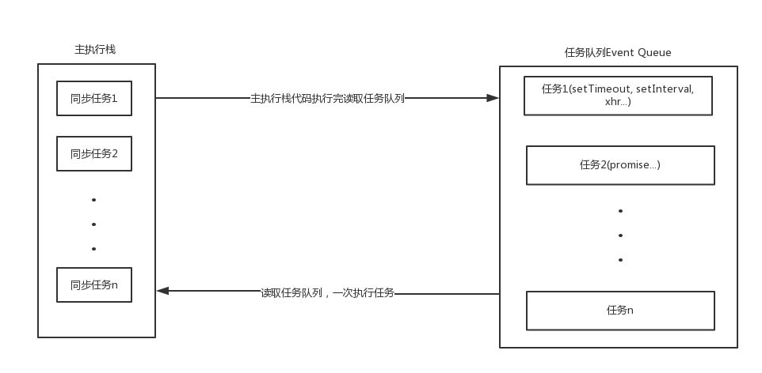

# 序章

## 学习地址

[MDN](https://developer.mozilla.org/zh-CN/docs/Web/JavaScript/Reference)(Mozilla Developer Center)：火狐开发者社区是一个完整的学习平台，你可以在这里深入学习Web技术以及能够驱动Web的软件 。

# 1. 第六章

## 1.1 Object

### 1.1.1 new操作符

``` js
let person = new Object(); 
person.name = "Nicholas"; 
person.age = 29;
```

### 1.1.2 对象字面量
对象字面量是对象定义的简写形式，目的是为了简化包含大量属性的对象的创建。

``` js
let person = { 
    name: "Nicholas", 
    age: 29 
};
```

也可以使用字符串、数字、bool类型来定义。

``` js
let person = { 
    "name": "Nicholas", 
    "age": 29, 
    5: true,
	true: 123,
    false: 321
};
person[5];	//true
person[true];	//123
person[false];	//321
```

但要注意此类情况（后值覆盖前值）：

``` js
let person = { 
    "name": "Nicholas", 
    "age": 29, 
    5: true,
	true: 123,
    true: 555,
    name: 'jack'
};
// 最后person变为
{
    5: true, 
    name: "jack", 
    age: 29, 
    true: 555
}
```

**思考：**

``` js
let person = {
    5:15,
    true: 'yes',
    false: 'no'
};
person.5;	// ?
person.true;	// ?
person.false;	// ?

person.__proto__ === ?;
person.__proto__.constructor === ?;

let person = new Object();
person.__proto__ === ?;
person.__proto__.constructor === ?;
```

### 1.1.3 访问/设置方式

> **点语法**
``` js 
let person = { 
	"name": "Nicholas", 
	"age": 29, 
	5: true,
	true: 123
};
person.name;	//"Nicholas"
person.age;		//29
person.name = 'jack';
person.age = 30;
person.true;	//对吗？
person.5;	//对吗？
```

> **中括号**

``` js
let person = { 
	"name": "Nicholas", 
	"age": 29, 
	5: true,
	true: 123
};
person['name'];	//"Nicholas"
person['age'];		//29
person['name'] = 'jack';
person['age'] = 30;
person[true];	//对吗？
person[5];	//对吗？
```


**思考：可以这样定义吗？如果可以，那么怎么访问name属性值呢？**

``` js
let name = {
    firstName: '张',
    lastName: '三'
};
let person = {
    [name]: '张三'
}
```

## 1.2 Array

### 1.2.1 Array构造函数

``` js
let colors = new Array();	//表示创建一个空数组
colors.length;	//0

let colors = new Array(5);	//表示创建一个长度为5的空数组
colors.length;	//5
colors[0];	//undefined
let colors = Array(5); //不用new也可以

let colors = new Array("red", "blue", "green");	//表示创建一个数组，并传入三个值
colors.length;	//3
colors[0];	//"red"
let names = Array("Greg"); //不用new也可以
```

**思考：**

``` js
let colors = new Array(3);
colors[0];	//？
colors.length;	//？
```

### 1.2.2 数组字面量

``` js
let colors = ["red", "blue", "green"]; // 创建一个包含3个元素的数组
let names = []; // 创建一个空数组
let values = [1,2,]; // 创建一个包含2个元素的数组
let ages = [,,,];	//创建一个包含3个三个空元素的数组
colors.length = 2;	//改变数组长度
colors[2];	//undefined
```

**思考：**

``` js
let cars = [1,2,,,];
cars.length;	//?

let cats = [1,2,,,5];
cats.length;	//?
cats[cats.length - 1];	//?

let dogs = [1,2,3];
dogs.length = 5;
dogs.length;	//?
dogs[dogs.length - 1];	//?
```

### 1.2.3 Array.from

第一个参数是一个类数组对象，即任何可迭代的结构，或者有一个 length 属性和可索引元素的结构。

``` js
// 字符串会被拆分为单字符数组 
console.log(Array.from("Matt")); // ["M", "a", "t", "t"]

// 可以使用from()将集合和映射转换为一个新数组
const s = new Set().add(1).add(2).add(3).add(4);
console.log(Array.from(s)); // [1, 2, 3, 4]

// Array.from()对现有数组执行浅复制
const a1 = [1, 2, 3, 4]; 
const a2 = Array.from(a1);
console.log(a1); // [1, 2, 3, 4]
a1 === a2; // false
a2.push(5);
a1.length;	//?

// arguments对象可以被轻松地转换为数组
function getArgsArray() { 
    return Array.from(arguments); 
}
console.log(getArgsArray(1, 2, 3, 4)); // [1, 2, 3, 4]

// from()也能转换带有必要属性的自定义对象
const arrayLikeObject = { 0: 1, 1: 2, 2: 3, 3: 4, length: 4 };
console.log(Array.from(arrayLikeObject)); // [1, 2, 3, 4]

//没有length的对象不行，因为会将0,1,2,3当做对象的key，而不当做是下标
const arrayLikeObject = { 0: 1, 1: 2, 2: 3, 3: 4 };
console.log(Array.from(arrayLikeObject)); // []
```

**思考：**

``` js
const arrayLikeObject = { 3: 1, 1: 2, 2: 3, 0: 4,length:4 };	//下标打乱顺序
console.log(Array.from(arrayLikeObject)); //?

const arrayLikeObject = { 3: 1, 1: 2, 2: 3, 0: 4,length:6 };	//长度多了2
console.log(Array.from(arrayLikeObject)); //?

const arrayLikeObject = { 3: 1, 1: 2, 2: 3, 0: 4,length:2 };	//长度只有2
console.log(Array.from(arrayLikeObject)); //?

//转换一个没有length的对象
const arrayLikeObject = { a:1, b:2 };
console.log(Array.from(arrayLikeObject)); //?

//转换一个有length的对象
const arrayLikeObject = { a:1, b:2, length:3 };
console.log(Array.from(arrayLikeObject)); //?
```

### 1.2.4 Array.of

`Array.of() `可以把一组参数转换为数组。这个方法用于替代在ES6之前常用的`Array.prototype.slice.call(arguments)`。

``` js
console.log(Array.of(1, 2, 3, 4)); // [1, 2, 3, 4] 
console.log(Array.of(undefined)); // [undefined]
```

### 1.2.5 检测数组

``` js
[] instanceof Array;	// true
Array.isArray([]);	//true
```

**思考：**

``` js
(new Array() instanceof Array);	//?
(Array.isArray(new Array()));	//?
```

### 1.2.6 fill

使用`fill()`方法可以向一个已有的数组中插入全部或部分相同的值。开始索引用于指定开始填充的位置，它是可选的。如果不提供结束索引，则一直填充到数组末尾。

[^负值索引]:负值索引从数组末尾开始计算，也可以将负索引想象成数组长度加上它得到的一个正索引（如果长度减去负索引还是得到负数，索引则从0开始）。

``` js
const zeroes = [0, 0, 0, 0, 0]; // 用5填充整个数组
zeroes.fill(5);
console.log(zeroes); // [5, 5, 5, 5, 5]

// 用6填充索引大于等于3的元素
zeroes.fill(0); // 重置
zeroes.fill(6, 3); 
console.log(zeroes); // [0, 0, 0, 6, 6]

// 用7填充索引大于等于1且小于3的元素
zeroes.fill(0); // 重置
zeroes.fill(7, 1, 3);
console.log(zeroes); // [0, 7, 7, 0, 0];

// 用8填充索引大于等于1且小于4的元素
// (-4 + zeroes.length = 1)
// (-1 + zeroes.length = 4)
zeroes.fill(8, -4, -1); 
console.log(zeroes); // [0, 8, 8, 8, 0];
```

> **`fill()`静默忽略超出数组边界、零长度及方向相反的索引范围**
[^fill()]:注解如下：
``` js
const zeroes = [0, 0, 0, 0, 0]; 
zeroes.fill(1, -10, -6);	// 索引过低，忽略
console.log(zeroes); // [0, 0, 0, 0, 0] 
zeroes.fill(1, 10, 15);		// 索引过高，忽略
console.log(zeroes);	// [0, 0, 0, 0, 0] 
zeroes.fill(2, 4, 2);	// 索引反向，忽略
console.log(zeroes); // [0, 0, 0, 0, 0]
zeroes.fill(4, 3, 10);	// 索引部分可用，填充可用部分 
console.log(zeroes); 	// [0, 0, 0, 4, 4]
```

**思考：**

``` js
const zeroes = [0, 0, 0, 0, 0]; 
zeroes.fill(1, -10, -1);
console.log(zeroes);	//?

const zeroes = [0, 0, 0, 0, 0]; 
zeroes.fill(1, -10, 20);
console.log(zeroes);	//?
```

### 1.2.7 copyWithin

`copyWithin()`会按照指定范围浅复制数组中的部分内容，然后将它们插入到指定索引开始的位置。开始索引和结束索引则与`fill()`使用同样的计算方法。

``` js
let ints = [0, 1, 2, 3, 4, 5, 6, 7, 8, 9];
// 从ints中复制索引0开始的内容，插入到索引5开始的位置
// 在源索引或目标索引到达数组边界时停止
ints.copyWithin(5); 
console.log(ints); // [0, 1, 2, 3, 4, 0, 1, 2, 3,4]

let ints = [0, 1, 2, 3, 4, 5, 6, 7, 8, 9];
// 从ints中复制索引5开始的内容，插入到索引0开始的位置
ints.copyWithin(0, 5); 
console.log(ints); // [5, 6, 7, 8, 9, 5, 6, 7, 8, 9]

let ints = [0, 1, 2, 3, 4, 5, 6, 7, 8, 9];
// 从ints中复制索引大于0并且小于3的内容
// 插入到索引4开始的位置
ints.copyWithin(4, 0, 3); 
console.log(ints); // [0, 1, 2, 3, 0, 1, 2, 7, 8, 9]

let ints = [0, 1, 2, 3, 4, 5, 6, 7, 8, 9];
ints.copyWithin(2, 0, 6); 
console.log(ints); // [0, 1, 0, 1, 2, 3, 4, 5, 8, 9]

// 支持负索引值，与fill()相对于数组末尾计算正向索引的过程是一样的
let ints = [0, 1, 2, 3, 4, 5, 6, 7, 8, 9];
ints.copyWithin(-4, -7, -3); 
console.log(ints); // [0, 1, 2, 3, 4, 5, 3, 4, 5, 6]
```

> **静默忽略超出数组边界、零长度及方向相反的索引范围（同[^fill()]方法一样）**

### 1.2.8 reverse

严格意义上来讲，`reverse`不是排序方法，它只是数组颠倒方法，可以将数组的顺序颠倒过来。

``` js
// 书中的例子，只是作为反向排序讲解，不够全面
let values = [1, 2, 3, 4, 5]; 
values.reverse();
console.log(values); // [5,4,3,2,1]

let numbers = [5,1,2,6,3];
numbers.reverse();
console.log(numbers); // [3, 6, 2, 1, 5]

let chars = ['c','b','d','a','w'];
chars.reverse();
console.log(chars); // ["w", "a", "d", "b", "c"]

let objs = [{a:1}, {a:5}, {a:3}];
objs.reverse();
console.log(objs);	// [{a:3},{a:5},{a:1}]
```
### 1.2.9 sort

`sort()`方法可以接收一个比较函数，用于判断哪个值应该排在前面。比较函数接收两个参数，如果第一个参数应该排在第二个参数前面，就返回负值；如果两个参数相等，就返回0；如果第一个参数应该排在第二个参数后面，就返回正值。

``` js
let values = [0, 1, 5, 10, 15];
values.sort();	// 不传比较函数出来的结果是不正常的
console.log(values); // 0,1,10,15,5

let values = [15, 1, 10, 5, 0];
values.sort(function (value1, value2) {
    if (value1 < value2) {
        return -1;
    }
    else if (value1 > value2) {
        return 1;
    }
    return 0;
});
console.log(values); // 0,1,5,10,15

//使用箭头函数简写
let values = [15, 1, 10, 5, 0];
values.sort((a, b) => a < b ? -1 : a > b ? 1 : 0);
console.log(values); // 0,1,5,10,15

//最简单的方法
let values = [15, 1, 10, 5, 0];
values.sort((a, b) => a - b);
console.log(values); // 0,1,5,10,15
```

**思考：**

``` js
let values = [15, 1, 10, 5, 0];
//使用function的方式写一个反向排序方法

//使用箭头函数简写
let values = [15, 1, 10, 5, 0];
//使用箭头函数简写的方式写一个反向排序方法

//最简单的方法
let values = [15, 1, 10, 5, 0];
//使用最简单的方法写一个反向排序方法
```

### 1.2.10 concat

`concat()`方法可以在现有数组全部元素基础上创建一个新数组。它首先会创建一个当前数组的副本，然后再把它的参数添加到副本末尾，最后返回这个新构建的数组。

``` js
let colors = ["red", "green", "blue"]; 
let colors2 = colors.concat("yellow", ["black", "brown"]); 
console.log(colors); // ["red", "green","blue"]
console.log(colors2); // ["red", "green", "blue", "yellow", "black", "brown"]

//不能添加第二层的数据
let colors = ["red", "green", "blue"]; 
let colors2 = colors.concat("yellow", ["black", "brown"],"aaa",["bbb",'ccc', ['a','b',['c']]]);
console.log(colors2);	//["red", "green", "blue", "yellow", "black", "brown", "aaa", "bbb", "ccc", Array(3)]
```

### 1.2.11 slice

`slice()`用于创建一个包含原有数组中一个或多个元素的新数组。`slice()`方法可以接收一个或两个参数：返回元素的开始索引和结束索引。如果只有一个参数，则 `slice()`会返回该索引到数组末尾的所有元素。如果有两个参数，则`slice()` 返回从开始索引到结束索引对应的所有元素，其中不包含结束索引对应的元素。

``` js
let colors = ["red", "green", "blue", "yellow", "purple"]; 
let colors2 = colors.slice(1); 
let colors3 = colors.slice(1, 4);
console.log(colors2);	// ["green", "blue", "yellow", "purple"
console.log(colors3);	// ["green", "blue", "yellow"]
console.log(colors);	// ["red", "green", "blue", "yellow", "purple"]
```

> - `slice()`的[^负值索引]跟`fill()`负值索引计算方式一样。
>
> - 静默忽略超出数组边界、零长度及方向相反的索引范围也跟[^fill()]方法的一样。

**思考：**

``` js
let numbers = [1,2,3,4,5];
console.log(numbers.slice(-5));		//?
console.log(numbers.slice(-5,-1));	//?
console.log(numbers.slice(-30));	//?
console.log(numbers.slice(-3,-5));	//?
```

### 1.2.12 splice

`splice()`是个非常强大的方法，可删除，替换，增加（**需非常熟悉**）。

- **删除**

  需要给 `splice()` 传2个参数：要删除的第一个元素的位置和要删除的元素数量。从原数组中删除任意多个元素，并返回一个数组，返回的数组包含删除的项。比如`splice(0, 2)` 会删除原数组前两个元素，并返回一个数组，数组中包含前两个已删除的项。

  ``` js
  let colors = ["red", "green", "blue"]; 
  let removed = colors.splice(0,1); // 删除第一项，并将第一项返回
  console.log(colors);	// ["green", "blue"]
  console.log(removed);	// ["red"]
  
  let colors = ["red", "green", "blue"]; 
  let removed = colors.splice(-3);
  console.log(colors);	// []
  console.log(removed);	// ["red", "green", "blue"]
  
  let colors = ["red", "green", "blue"]; 
  let removed = colors.splice(-3,2);
  console.log(colors);	// ["blue"]
  console.log(removed);	// ["red", "green"]
  ```

- **插入**

  需要给 `splice()` 传3个参数：开始位置、0（要删除的元素数量）和要插入的元素，可以在数组中指定的位置插入元素。第三个参数之后还可以传第四个、第五个参数，乃至任意多个要插入的元素。比如，`splice(2, 0, "red", "green")` 会从数组位置2开始插入字符串 "red" 和 "green" 。

  ``` js
  let colors = ["red", "green", "blue"]; 
  let removed = colors.splice(1, 0, "yellow", "orange"); // 在位置1插入两个元素
  console.log(colors);	// ["red", "yellow", "orange", "green", "blue"]
  console.log(removed);	// []
  ```

- **替换**

  `splice()` 在删除元素的同时可以在指定位置插入新元素，样要传入3个参数：开始位置、要删除元素的数量和要插入的任意多个元素。要插入的元素数量不一定跟删除的元素数量一致。比如，`splice(2, 1, "red", "green")` 会在位置2删除一个元素，然后从该位置开始向数组中插入 "red" 和 "green"。

  ``` js
  let colors = ["red", "green", "blue"]; 
  let removed = colors.splice(1, 1, "red", "purple"); // 插入两个值，删除一个元素
  console.log(colors);	// ["red", "red", "purple", "blue"]
  console.log(removed);	// ["green"]
  ```

  **思考：**

  ```   js
  let colors = ["red", "green", "blue"];
  //写一个方法将colors所有的内容清空并替换为["yellow", "white"]
  ```

### 1.2.13 寻找下标

- **indexOf**

  从左到右搜索第一个===的下标。

  ``` js
  [1,2,3].indexOf(1);	// 0
  [1,2,3].indexOf('1');	// -1，因为不全等，找不到就返回-1
  [1,2,3,1,5,6].indexOf(1, 2);	// 3，第二个参数是从x下标开始搜索
  ```

- **lastIndexOf**

  从右往左搜索第一个===的下标。

  ``` js
  [1,2,3,1,5,7].lastIndexOf(1);	// 3
  [1,2,3,1,5,7,1,5].lastIndexOf(1, 100);	// 6 第二个参数是从x下标开始搜索
  [1,2,3,1,5,7,1,5].lastIndexOf(1, 5);	// 3
  ```

**思考：**

``` js
[1,2,3,1,5,6].indexOf(1, -2);	// ?
[1,2,3,1,5,6].indexOf(1, -3);	// ?   
[1,2,3,1,5,7,1,5].lastIndexOf(1, -7);	// ?
[1,2,3,1,5,7,1,5].lastIndexOf(1, -5);	// ? 3
```

### 1.2.14 includes

判断数组内是否有===的项。

``` js
[1,2,3,4,5,6].includes(1);	// true
[1,2,3,4,5,6].includes('1');	// false，因为不全等
[1,2,3,4,5,6].includes(8);	// false
```

### 1.2.15 find

根据条件查找数组内的单个项，根据条件查找项，只要返回true那就证明找到了，如果为false的话，那就继续遍历查找。

``` js
[1,2,3].find(c=> c === 1);	// 1
[1,2,3].find(c=> c == '1');	// 1
[1,2,3].find(c=> c === 5);	// undefined
[1,2,3].find(c=> c > 1);	// 2

const people = [{
    name: "Matt",
    age: 27
},
{
    name: "Nicholas",
    age: 29
}];
//三个参数分别是：当前遍历的项、当前下标、原始数组。
let p = people.find((element, index, array) => {
    console.log(element, index, array);
    return element.age > 28;
});
console.log(p);		// {name: "Nicholas", age: 29}
```

### 1.2.16 findIndex

根据条件查找数组内匹配项的下标。

``` js
[1,2,3].findIndex(c=> c === 3);	// 2
[1,2,3].findIndex(c=> c === 5);	// -1
[1,2,3].findIndex(c=> c > 1);	// 1
```

### 1.2.17 every

验证数组内每一个项是否匹配。

``` js
[1,2,3].every(c=> c === 3);	// false
[1,2,3].every(c=> c > 0);	// true
[1,2,3].every(c=> c < 10);	// true
[1,1,1].every(c=> c === 1);	// true
[1, 2, 3, 4, 5, 4, 3, 2, 1].every((item, index, array) => item > 2);    // false
```

### 1.2.18 some

验证数组内某一个项是否匹配。

``` js
[1,2,3].some(c=> c === 3);	// true
[1,2,3].some(c=> c > 0);	// true
[1,2,3].some(c=> c < 10);	// true
[1,1,1].some(c=> c === 1);	// true
[1,2,3].some(c=> c === 5);	// false
[1, 2, 3, 4, 5, 4, 3, 2, 1].some((item, index, array) => item > 2);     // true
```

### 1.2.19 filter

创建一个新数组，根据条件将搜索匹配的项放入至新数组内，并将此数组返回。

``` js
[1,2,3].filter(c=> c > 1);	// [2,3]
[1,2,3].filter(c=> c > 5);	// []
[1,2,3].filter(c=> c === 3);	// [3]
[1, 2, 3, 4, 5, 4, 3, 2, 1].filter((item, index, array) => item > 2);	//[3, 4, 5, 4, 3]
```

### 1.2.20 forEach

遍历每一个数组，传入回调函数，可对每一个项进行操作（用`return`无法停止，会遍历完所有的项）。

``` js
[1, 2, 3].forEach(c => {
    console.log(c * 2);
});
// 2 4 6

[1, 2, 3].forEach((item, index, array) => {
    console.log(item * index);
});
// 0 2 6
```

**思考：**

``` js
let numbers = [{ a: 1 }, { a: 2 }, { a: 3 }];
numbers.forEach((item, index, array) => {
    if (item.a > 1) {
        item.a = index;
    }
});
console.log(numbers);	// ?
```

### 1.2.21 flat

将多维数组扁平化，并返回一个新数组。方法接受一个数值，表示要扁平化的数组维度。

``` js
let ary = [1, [2, [3, [4, 5]]], 6];
console.log(ary.flat(1));	// [1, 2, Array(2), 6]
console.log(ary.flat());	// [1, 2, Array(2), 6]，不传参默认为1
console.log(ary.flat(2));	// [1, 2, 3, Array(2), 6]
console.log(ary.flat(3));	// [1, 2, 3, 4, 5, 6]
console.log(ary.flat(100));	// [1, 2, 3, 4, 5, 6]，可以超过维度深度，超过则会扁平化所有维度
console.log(ary.flat(Infinity));	//无限大的层数，表示可以扁平化所有维度
console.log(ary);	// [1, Array(2), 6]
```

### 1.2.22 map

遍历数组，针对每一个项返回一个新值，将新值放进新数组里，最后将新数组返回。

``` js
[1, 2, 3].map(c => {
    return c * 2;
});	// [2,4,6]

[1, 2, 3].map(c => {
    return 2;
});	// [2,2,2]

[1, 2, 3].map((item, index, array) => {
    return item * index;
});	// [0,2,6]

[{ a: 1 }, { a: 2 }, { a: 3 }, { a: 4 }, { a: 5 }].map(c => c.a);	// [1, 2, 3, 4, 5]
```

**思考：**

``` js
[1, 2, 3].map((item, index, array) => {
    return index;
});	// ?

[1, 2, 3].map((item, index, array) => {
    return index * array.length;
});	// ?

let numbers =[{ a: 1 }, { a: 2 }, { a: 3 }, { a: 4 }, { a: 5 }];
//请使用map方法将numbers数据变为[3,6,9,12,15]

//请使用map方法将numbers数据变为[3,6,9,8,10]

let numbers = [{ a: 1, b: 10 }, { a: 2, b: 10 }, { a: 3, b: 10 }, { a: 4, b: 10 }, { a: 5, b: 10 }];
//请使用map方法将numbers数据变为[9,8,7,6,5]
```

### 1.2.23 join

数组拼接成字符串方法，方法传入拼接关键字。

``` js
[1,2,3].join(',');	// '1,2,3'
```

**思考：**

``` js
[{ a: 1 }, { a: 2 }].join(',');	// ?

let persons = [{ age: 50 }, { age: 12 }, { age: 30 }];
//请写一个方法将persons变为 '12,30,50'
```

### 1.2.24 pop

从原数组取出最后一个项。

``` js
let numbers = [1,2,3,4,5];
numbers.pop();	// 5
console.log(numbers);   // [1,2,3,4]

let empty = [];
empty.pop();	// undefined
console.log(empty);	// []
```

### 1.2.25 shift

从原数组取出第一个项。

``` js
let numbers = [1,2,3,4,5];
numbers.shift();    // 1
console.log(numbers);   // [2,3,4,5]
```

### 1.2.26 unshift

在原数组的头部添加随意数量的项，并返回添加后数组的长度。

``` js
let numbers = [1, 2, 3, 4, 5];
let length = numbers.unshift(7, 8, 9);
console.log(length);    // 8
console.log(numbers);   // [7, 8, 9, 1, 2, 3, 4, 5]
```

### 1.2.27 reduce

方法接收一个函数作为累加器，数组中的每个值（从左到右）开始缩减，最终计算为一个值。 

``` js
let arr = [1, 2, 3, 4, 5];
console.log(arr.reduce((total, next) => total + next));
//等价
let total = 0;
for (let next of arr) {
	total += next;
}
console.log(total);
```

## 1.3 Set

Set是一个无法添加重复值的集合。

``` js
const set = new Set();	//创建一个空集合

const s1 = new Set(["val1", "val2", "val3"]);	// 使用数组初始化集合
console.log(s1.size);		// 3,长度访问跟数组的length不一样
s1.add("Matt").add("Frisbie");	//可以链式添加
s1.has('Matt');	// true，是否存在指定的项
console.log(s1);	// Set(5) {"val1", "val2", "val3", "Matt", "Frisbie"}
s1.add("Matt");
console.log(s1);	// Set(5) {"val1", "val2", "val3", "Matt", "Frisbie"}，无法添加重复项

let deleted = s1.delete('Matt');	// delete方法返回删除结果
console.log(deleted);   // true
console.log(s1);    // Set(4) {"val1", "val2", "val3", "Frisbie"}

deleted = s1.delete('Matt');
console.log(deleted);   // false，无法重复删除

//可通过for of访问每个项
for (let item of s1) {
    console.log(item);
}
//val1 val2  val3 Frisbie

//也可通过forEach方法访问
s1.forEach(item => console.log(item));
```

> **Set的经典应用-去重**

``` js
let numbers = [1, 2, 3, 5, 6, 1, 2, 3];
numbers = Array.from(new Set(numbers));
console.log(numbers);   // [1, 2, 3, 5, 6]
```

**思考：**

``` js
let chars = ['a', 'b', 'c', 'a', 'c', 'd'];
// 将chars去重
```

**作业：**

``` js
let objs = [{ count: 20 }, { count: 66 }, { count: 16 }, { count: 30 }, { count: 5 }, { count: 20 }, { count: 66 }];
//使用objs打印 "5,16,20,30,66"

//使用objs打印 "20,30,66"
```

# 2. 第八章

## 2.1 对象属性的类型

### 2.1.1 configurable（可配置）

表示属性是否可以通过`delete`删除并重新定义，是否可以修改它的特性，以及是否可以把它改为访问器属性。默认情况下，所有直接定义在对象上的属性的这个特性都是 `true`。

``` js
let person = {};
Object.defineProperty(person, "name", {
    configurable: false,
    value: undefined
});
console.log(person);    //{name: undefined}
delete person.name;  //false
console.log(person);    //{name: undefined}
```

``` js
let person = {};
Object.defineProperty(person, "name", {
    configurable: true,
    value: undefined
});
console.log(person);    //{name: undefined}
delete person.name;  //true
console.log(person);    //{}
```

``` js
let person = {};
Object.defineProperty(person,
    "name", {
    configurable: false,
    value: "Nicholas"
});
//Uncaught TypeError: Cannot redefine property: name
Object.defineProperty(person, "name", {
    configurable: true,
    value: "Nicholas"
});
```

### 2.1.2 enumerable

表示属性是否可以通过`for-in`循环返回。默认情况下，所有直接定义在对象上的属性的这个特性都是`true`。 

``` js
let person = {};
Object.defineProperties(person, {
    name: {
        enumerable: false
    },
    sex: {
        enumerable: true
    },
    age: {
        enumerable: true
    }
});
for (let key in person) {
    console.log(key);
}
// sex
// age
```

### 2.1.3 writable

表示属性的值是否可以被修改。默认情况下，所有直接定义在对象上的属性的这个特性都是`true`。

``` js
var obj = {};
Object.defineProperties(obj, {
    sex: {
        value: '男',
        writable: true
    },
    name: {
        value: '张三',
        writable: false
    }
});
obj.name = '李四';
obj.sex = '女';
console.log(obj);   //{sex: "女", name: "张三"}
```

### 2.1.4 value

包含属性实际的值。这就是前面提到的那个读取和写入属性值的位置。这个特性的默认值为`undefined`。

``` js
let person = {};
Object.defineProperty(person, "name", {
    value: "Nicholas"
});
console.log(person.name);   //Nicholas
```

### 2.1.5 get

获取函数，在读取属性时调用。默认值为`undefined`。

``` js
let book = {
    year_: 2017, 
    edition: 1
};
Object.defineProperty(book, "year", {
    get() {
        return this.year_;
    }
});
console.log(book.year); // 2017
console.log(book.edition); // 1
```

### 2.1.6 set

设置函数，在写入属性时调用。默认值为`undefined`。

``` js
let book = {
    year_: 2017, 
    edition: 1
};
Object.defineProperty(book, "year", {
    get() {
        return this.year_;
    },
    set(newValue) {
        if (newValue > 2017) {
            this.year_ = newValue;
            this.edition += newValue - 2017;
        }
    }
});
book.year = 2018;
console.log(book.year); // 2018
console.log(book.edition); // 2
```

## 2.2 获取属性描述

### 2.2.1 getOwnPropertyDescriptor

获取指定属性的属性描述符。这个方法接收两个参数：属性所在的对象和要取得其描述符的属性名。返回值是一个对象，对于访问器属性包含属性的类型。

``` js
let book = { name: '张三' };
console.log(Object.getOwnPropertyDescriptor(book, 'name'));	//{value: "张三", writable: true, enumerable: true, configurable: true}
```

### 2.2.2 getOwnPropertyDescriptors

方法用来获取一个对象的所有自身属性的描述符。

``` js
let book = { name: '张三', age: 12 };
console.log(Object.getOwnPropertyDescriptors(book));
/**
{
    age: { value: 12, writable: true, enumerable: true, configurable: true }
    name: { value: "张三", writable: true, enumerable: true, configurable: true }
}
*/
```

## 2.3 合并对象

在`es6`之前，通常会封装一个方法，可参考`jqeury`的[`extend`](https://www.runoob.com/jquery/misc-extend.html)方法。

``` js
var obj = {
    a: 1,
    b: 2
}
var obj1 = {
    c: 3,
    a: 5
}
{
    a: 5,
    b: 2,
    c: 3
}
```

``` js
//一个特别简单的浅拷贝
function extend(target, source) {
    target = target || {};
    if (typeof target !== 'object') {
        throw new Error('target不是对象');
    }
    if (!source) {
        throw new Error('source不能为空');
    }
    if (typeof source !== 'object') {
        throw new Error('source不是对象');
    }
    for (let key in source) {
        target[key] = source[key];  //然后将源对象的值赋值到target中
    }
    return target;  //最后返回target
}

var obj = extend({
    a: 1,
    b: 2
}, {
    c: 3,
    a: 5
})
/**
{
    a: 5,
    b: 2,
    c: 3
}
*/
```

> **Object.assign**

用于对象的合并，将源对象`（source）`的所有可枚举属性，复制到目标对象`（target）`。源对象可以是多个，后者替换前者。

``` js
let obj = Object.assign({ a: 1 }, { b: 2 }, { c: 3 }, { a: 5 }, { b: 6 });
//{a: 5, b: 6, c: 3}
```

**出现的问题：**

以上方法都是**浅拷贝**，如果拷贝属性是对象，那么拷贝的只是引用。

``` js
var obj = {
    a: 1,
    b: 'fff'
}
var obj1 = {
    a: 2,
    c: {
        name: '李四',
        age: 20
    }
}
var obj2 = Object.assign({}, obj, obj1);
obj1.a = 3;
obj1.c.name = '王五';
obj1.c.age = 30;
console.log(obj2);	//obj2.c会跟着obj1.c的改变而改变
```

> **深拷贝**

``` js
//深拷贝
function deepClone(target, source) {
    if (typeof target !== 'object' || !target) {
        return source || target;
    }
    if (typeof source !== 'object' || !source) {
        return source;
    }
    for (let key in source) {
        var item = source[key];
        if (typeof item === 'object' && item) {
            target[key] = deepClone(Array.isArray(item) ? [] : {}, item);
        } else {
            target[key] = item;
        }
    }
    return target;
}

var obj = {
    a: 1,
    b: 'fff'
}
var obj1 = {
    a: 2,
    c: {
        name: '李四',
        age: 20
    }
}
var obj2 = deepClone(obj, obj1);
obj1.a = 3;
obj1.c.name = '王五';
obj1.c.age = 30;
console.log(obj2);	//obj2.c不会跟着obj1.c的改变而改变
```

## 2.4 解构

``` js
// 使用对象解构
let person = { name: 'Matt', age: 27 };
//可以使用别名 personAge
//相当于 let name = person.name;
//相当于 let personAge = person.age;
let { name, age: personAge } = person;
console.log(name, personAge);	//Matt   27
```

``` js
let person = { name: 'Matt', age: 27 };
let { job } = person;	//不存在的也可以解构，其实就相当于   let job = person.job;
console.log(job);	//undefined
```

``` js
let person = { name: 'Matt', age: 27, sex: null };
//也可以设置一个默认值，如果获取的值为undefined的话
//注：如果获取的值为null则不会取默认值，而是直接设置为null
let { name, job = 'Software engineer', sex = '男' } = person;
console.log(name); // Matt 
console.log(sex);	//null
console.log(job); // Software engineer
```

``` js
//无法解构null和undefined
let { _ } = null; // TypeError
let { _ } = undefined; // TypeError
```

``` js
const [n1, n2, { a }] = [1, 2, { a: 3 }];	//解构数组
console.log(n1, n2, a); // 1 2 3
```

**思考：**

``` js
const data = [
    {
        name: '张三',
        age: 50,
        sex: '男',
        children: [
            {
                name: '张琳',
                sex: '女',
                age: 20
            }
        ]
    },
    {
        name: '王五',
        age: 25,
        sex: undefined
    }
];
//把每个人的 name,age,sex解构出来，没有sex的设置默认值：男，重名的设置别名
```

## 2.5 创建对象

**思考：**假如现在有个需求，要创建5个人物对象，需要有名字、年龄、工作，大家会怎么写？

**千万不要一个一个对象的去定义，不要重复相同的劳动，毫无意义！！！**

### 2.5.1 简单工厂模式

简单理解工厂就是有一条标准化的流水线，只要输入参数就能按照标准流程生产出需要的产品。

``` js
function createPerson(name, age, job) {
    let o = new Object();
    o.name = name;
    o.age = age;
    o.job = job;
    o.sayName = function () {
        console.log(this.name);
    };
    return o;
}
let person1 = createPerson("Nicholas", 29, "Software Engineer");
let person2 = createPerson("Greg", 27, "Doctor");
```

### 2.5.2 构造函数模式

``` js
function Person(name, age, job) {
    this.name = name;
    this.age = age;
    this.job = job;
    this.sayName = function () {
        console.log(this.name);
    };
}

let person1 = new Person("Nicholas", 29, "Software Engineer"); 
let person2 = new Person("Greg", 27, "Doctor"); 
person1.sayName(); // Nicholas 
person2.sayName(); // Greg
console.log(person1.constructor == Person); // true 
console.log(person2.constructor == Person); // true

console.log(person2 instanceof Object); // true 
console.log(person2 instanceof Person); // true
```

``` js
//写成函数表达式也行
let Person = function (name, age, job) {
    this.name = name;
    this.age = age;
    this.job = job;
    this.sayName = function () {
        console.log(this.name);
    };
}

let person1 = new Person("Nicholas", 29, "Software Engineer"); 
let person2 = new Person("Greg", 27, "Doctor"); 
person1.sayName(); // Nicholas 
person2.sayName(); // Greg
console.log(person1.constructor == Person); // true 
console.log(person2.constructor == Person); // true

console.log(person2 instanceof Object); // true 
console.log(person2 instanceof Person); // true
```

**缺陷：**每次`sayName`方法都要重新定义一次，其实这个方法只需定义一次即可。

### 2.5.3 原型模式

``` js
function Person() { }
Person.prototype.name = "Nicholas";
Person.prototype.age = 29;
Person.prototype.job = "Software Engineer";
Person.prototype.sayName = function () {
    console.log(this.name);
};
```

**缺陷：** 1. 原型上的对象数据会被共享，一个对象改了，其他对象也会跟着变。2. 创建对象不方便。

> **改良**

``` js
function Person(name, age, job) {
    this.name = name;
    this.age = age;
    this.job = job;
}
//将无需重复定义/共享的定义在原型上
Person.prototype.sayName = function () {
    console.log(this.name);
};

let person1 = new Person("Nicholas", 29, "Software Engineer"); 
let person2 = new Person("Greg", 27, "Doctor"); 
person1.sayName(); // Nicholas 
person2.sayName(); // Greg
```

## 2.6 hasOwnProperty

`hasOwnProperty()`方法用于确定某个属性是在实例上还是在原型对象上。

``` js
function Person() { }
Person.prototype.age = 12;
let person1 = new Person;
person1.age = 20;
console.log(person1.age);	//20
console.log(person1.hasOwnProperty("age"));	//true	来自实例
delete person1.age;
console.log(person1.age);	//12
console.log(person1.hasOwnProperty("age"));	//false	来自原型
```

> **in**

`in`操作符会在可以通过对象访问指定属性时返回`true`，无论该属性是在实例上还是在原型上。

``` js
function Person() { }
Person.prototype.age = 12;
let person1 = new Person;
person1.age = 20;
console.log(person1.age);	//20
console.log(person1.hasOwnProperty("age"));	//true	来自实例
'age' in person1;	//true
delete person1.age;
console.log(person1.age);	//12
console.log(person1.hasOwnProperty("age"));	//false	来自原型
'age' in person1;	//true
```

**思考**：

如何判断一个属性是来自原型而不是来自实例呢？

## 2.7 keys

`Object.keys()`方法接收一个对象作为参数，返回包含该对象所有可枚举的实例属性名称的字符串数组。

``` js
Object.keys({ a: 1, b: 2, c: 3 });  //["a", "b", "c"]
```

## 2.8 getOwnPropertyNames

`Object.getOwnPropertyNames()`方法可以获取所有实例属性，无论是否可以枚举。

``` js
function Person() {
    this.sex = '男';
}
Person.prototype.name = "Nicholas";
Person.prototype.age = 29;
Person.prototype.job = "Software Engineer";
Person.prototype.sayName = function () {
    console.log(this.name);
};
var p = new Person();
console.log(Object.getOwnPropertyNames(p)); //?
```

## 2.9 values

 `Object.values()`返回对象值的数组。

``` js
const o = {
    foo: 'bar',
    baz: 1,
    qux: {}
};
console.log(Object.values(o)); // ["bar", 1, {}]
```

## 2.10 entries

 `Object.entries()` 接收一个对象，返回键/值对的数组。

``` js
const o = {
    foo: 'bar',
    baz: 1,
    qux: {}
};
console.log(Object.entries(o));	// [["foo", "bar"], ["baz", 1], ["qux", {}]]
```

**思考：**

``` js
const o = {
    foo: 'bar',
    baz: 1,
    qux: {}
};
Object.entries(o);	//用解构将所有的key和value解构出来
```

## 2.11 原型

 每个对象都有一个特殊的属性叫作`原型（prototype）`，在原型上定义的属性和方法会被每一个实例对象共享。

``` js
function Person() { }
Person.prototype.name = "无名";
Person.prototype.children = [];
Person.prototype.sayName = function () {
    console.log(`我的名字叫：${this.name}`);
}

let zhangsan = new Person();
let lisi = new Person();
console.log(zhangsan.name);
console.log(lisi.name);
console.log(zhangsan.hasOwnProperty('name'));
zhangsan.name = '张三';
console.log(zhangsan.hasOwnProperty('name'));
console.log(lisi.name);
Person.prototype.name = '有名';
console.log(lisi.name);
console.log(zhangsan.name);
delete zhangsan.name;
console.log(zhangsan.name);

lisi.name = '李四';
console.log(zhangsan.sayName());
console.log(lisi.sayName());
console.log(zhangsan.sayName === lisi.sayName);

zhangsan.children.push('张欣');
console.log(zhangsan.children);
console.log(lisi.children);
console.log(zhangsan.hasOwnProperty('children'));
console.log(zhangsan.children === lisi.children);
//?
```

## 2.12 原型链

每个构造函数都有一个原型对象，原型有一个属性指回构造函数，而实例有一个内部指针指向原型。如果原型是另一个类型的实例呢？那就意味着这个原型本身有一个内部指针指向另一个原型，相应地另一个原型也有一个内部指针指向另一个构造函数的原型对象，这样就在实例和原型之间构造了一条原型链。

```` js
function Person() { }
Person.prototype.constructor === ?;
Person.prototype.constructor.prototype === ?;
Person.prototype.__proto__ === ?

let zhangsan = new Person;
zhangsan.constructor === Person;
zhangsan.__proto__ === ?;
zhangsan.__proto__.__proto__ === ?
````

``` js
let obj = new Object();
obj.__proto__ === ?;
obj.__proto__.__proto__ === ?
```

## 2.13 面向过程

现在有个需求：创建一个人，张三、男、20岁。

``` js
let zhangsan = new Object;
zhangsan.name = '张三';
zhangsan.age = 20;
zhangsan.sex = '男';
```

又新来了一个需求：创建一个人，李四、男、30岁。

``` js
let lisi = new Object;
lisi.name = '李四';
lisi.age = 30;
lisi.sex = '男';
```

随着需求的不断增加，已经添加了1000个人。

``` js
let zhangsan = new Object;
zhangsan.name = '张三';
zhangsan.age = 20;
zhangsan.sex = '男';

let lisi = new Object;
lisi.name = '李四';
lisi.age = 30;
lisi.sex = '男';
//...........剩下的3992行代码
```

然后突然有一天新增了一个需求：将所有年龄>=20的标记为青年，<20的标记为少年。

``` js
let zhangsan = new Object;
zhangsan.name = '张三';
zhangsan.age = 20;
zhangsan.sex = '男';
zhangsan.type = '青年';

let lisi = new Object;
lisi.name = '李四';
lisi.age = 30;
lisi.sex = '男';
zhangsan.type = '青年';
//...........剩下的4990行代码
```

突然有一天，又要为每个人新增一个行为：能自我介绍。

...........更多的需求

**思考：**面向过程的痛点是什么？怎么去解决它？

## 2.14 面向对象

将任何事物都想象成一个对象，并提炼出这个对象的属性、行为等，然后封装起来。

需求：创建一个人，张三、男、20岁。

此刻，首先需将人想象为一个对象，目前给出的三个属性是姓名、性别、年龄，将封装思想用起来。

``` js
function Person(name, age, sex) {
    this.name = name;
    this.age = age;
    this.sex = sex;
}

let zhangsan = new Person('张三', 20, '男');
```

又新来了一个需求：创建一个人，李四、男、30岁。

``` js
let lisi = new Person('李四', 30, '男');
```

随着需求的不断增加，已经添加了1000个人。

``` js
function Person(name, age, sex) {
    this.name = name;
    this.age = age;
    this.sex = sex;
}

let zhangsan = new Person('张三', 20, '男');
let lisi = new Person('李四', 30, '男');
//...   剩下的998行代码
```

然后突然有一天新增了一个需求：将所有年龄>=20的标记为青年，<20的标记为少年。

``` js
function Person(name, age, sex) {
    this.name = name;
    this.age = age;
    this.sex = sex;
    //只需在构造函数里新增一个判断即可，其他每个实例都不用动
    if (this.age >= 20) {
        this.type = '青年';
    }
    else {
        this.type = '少年';
    }
}
```

突然有一天，又要为每个人新增一个行为：能自我介绍。

``` js
function Person(name, age, sex) {
    this.name = name;
    this.age = age;
    this.sex = sex;
    if (this.age >= 20) {
        this.type = '青年';
    }
    else {
        this.type = '少年';
    }
}

Person.prototype.say = function () {
    console.log(`我是${this.name}，我今年${this.age}岁了，我是个${this.sex}人，算是${this.type}了`);
}

let zhangsan = new Person('张三', 20, '男');
let lisi = new Person('李四', 30, '男');
//...  剩下的998行代码
console.log(zhangsan.say());
console.log(lisi.say());
```

##  2.15 继承

继承就是子继承父的所有属性和方法，如：父亲的基因被儿子继承，所以通过DNA（原型链）可追溯某人的向上继承关系。从技术上来讲就是继承父对象的所有属性和方法。

``` js
function Father() {
    this.money = 10000000000;   //百亿家产
    this.houses = 10;   //10栋别墅
    this.cars = 100;    //100辆车
}

function Son() {
    Father.call(this);  //继承父亲的家产
}

let son = new Son;
console.log(son.money, son.houses, son.cars);   //10000000000 10 100
```

### 2.15.1 原型式继承

``` js
function superType() {
    this.name = '张三';
    this.children = ['张欣', '张宇'];
}
superType.prototype.age = 12;
function sub() {
}
sub.prototype = new superType();
var s = new sub();
console.log(s.name, s.age);    //张三 12
console.log(s.hasOwnProperty('name'));  //false
console.log(s.hasOwnProperty('children'));  //false

var s1 = new sub();
s1.children.push('李四');
console.log(s1.children);
console.log(s.children);

console.log(s.constructor === superType);   //true
console.log(s instanceof sub);  //true
console.log(s instanceof superType);    //true
```

### 2.15.2 盗用构造函数

``` js
function superType() {
    this.name = '张三';
    this.children = ['张欣', '张宇'];
}
superType.prototype.age = 12;
function sub() {
    superType.call(this);
}

var s = new sub();	//从sub派生出来的，继承自sub
console.log(s.name);    //张三
console.log(s.hasOwnProperty('name'));  //true
console.log(s.hasOwnProperty('children'));  //true

var s1 = new sub();
s1.children.push('李四');
console.log(s1.children);
console.log(s.children);

console.log(s.constructor === sub);   //true
console.log(s instanceof sub);  //true
console.log(s instanceof superType);    //false
//目前为止一切看起来都正常了
console.log(s.age, s1.age);
```

### 2.15.3 组合继承

组合继承（有时候也叫伪经典继承）综合了原型链和盗用构造函数，将两者的优点集中了起来。基本的思路是使用原型链继承原型上的属性和方法，而通过盗用构造函数继承实例属性。这样既可以把方法定义在原型上以实现重用，又可以让每个实例都有自己的属性。

``` js
function superType() {
    console.log('superType执行了一次');
    this.name = '张三';
    this.children = ['张欣', '张宇'];
}
superType.prototype.age = 12;
function sub() {
    superType.call(this);
}

//直接继承原型，不用再次实例化父类构造函数，防止再次执行父类构造函数
//sub.prototype = Object.create(superType.prototype, { constructor:{ value:sub, enumerable:false } });

//跟上面的一样，只是最后自己手动修改一下构造函数的指向
sub.prototype = Object.create(superType.prototype)
sub.prototype.constructor = sub;

//使用浅拷贝的方式将自身的构造函数替换掉父类原型的构造函数
//sub.prototype = Object.assign(Object.create(superType.prototype), { constructor: sub });

var s = new sub();
console.log(s.name);    //张三
console.log(s.hasOwnProperty('name'));  //true
console.log(s.hasOwnProperty('children'));  //true

var s1 = new sub();
s1.children.push('李四');
console.log(s1.children);
console.log(s.children);

console.log(s.constructor === sub);   //true
console.log(s instanceof sub);  //true
console.log(s instanceof superType);    //true
console.log(s.age, s1.age);     //12 12
```

## 2.16 class类

与函数类型相似，定义类也有两种主要方式：类声明和类表达式。这两种方式都使用`class`关键字加大括号。类其实就是语法糖。

``` js
// 类声明
class Person {} 
// 类表达式
const Animal = class {};
```

函数可以提升，但是类不能提升。

``` js
console.log(ClassDeclaration); //ReferenceError: ClassDeclaration is not defined
class ClassDeclaration {}

//同样也受到块级作用域的限制
{ 
    function FunctionDeclaration() {} 
	class ClassDeclaration {} 
}
console.log(FunctionDeclaration);	//FunctionDeclaration() {} 
console.log(ClassDeclaration);	//ReferenceError: ClassDeclaration is not defined
```

### 2.16.1 类的构成

类可以包含构造函数方法、实例方法、获取函数、设置函数和静态类方法，但这些都不是必需的。空的类定义照样有效。默认情况下，**类定义中的代码都在严格模式下执行**。

``` js
// 空类定义，有效
class Foo {} 
// 有构造函数的类，有效
class Bar { 
    constructor() {} 
}
// 有获取函数的类，有效
class Baz { 
    get myBaz() {} 
}
// 有静态方法的类，有效
class Qux { 
    static myQux() {} 
}
```

``` js
class Person {
    constructor() {}

    name = '张三';
    _age = 17;
    children = [];

    say() {
        console.log(`我的名字叫：${this.name}`);
    }

    static isPerson(person) {
        return person instanceof Person;
    }

    get type() {
        if (this._age > 18) {
            return '青年';
        }
        return '少年';
    }

    get age() {
        return this._age;
    }

    set age(value) {
        if (value > 0 && value < 120) {
            this._age = value;
        }
    }
}

let person = new Person();
console.log(person.age, person.type);
person.age = 0;
console.log(person.age);
person.age = 20;
console.log(person.type);
console.log(Person.isPerson(person), Person.isPerson(new Object()));
console.log(person.hasOwnProperty('name'), person.hasOwnProperty('children'));
```

### 2.16.2 类构造函数

`constructor`关键字用于在类定义块内部创建类的构造函数。方法名`constructor`会告诉解释器在使用`new`操作符创建类的新实例时，应该调用这个函数。

``` js
class Animal { }
class Person {
    constructor() {
        console.log('person ctor');
    }
}
class Vegetable {
    constructor(color) {
        this.color = color;
    }
}
let a = new Animal();
let p = new Person(); // person ctor 
let v = new Vegetable('orange');
console.log(v.color); // orange
```

``` js
//和下面代码等价
function Person() {
    console.log('person ctor');
}
function Vegetable(color) {
    this.color = color;
}
let p = new Person(); // person ctor 
let v = new Vegetable('orange');
console.log(v.color); // orange
```

> **super**

`super`表示父对象。

``` js
class Father {
    constructor(name, age, sex) {
        this.name = name;
        this.age = age;
        this.sex = sex;
    }

    money = 0;	//总钱数

	//挣钱
    makeMoney(money) {
        this.money += money;
        console.log(`这次赚了${money}，到目前为止总共已经赚了${this.money}了。`);
    }

    say() {
        console.log(`我叫${this.name}，今年${this.age}岁。`);
    }
}

class Son extends Father {
    constructor(name, age, sex) {
        super(name, age, sex);  //super作为父类构造函数只能用在子类构造函数中
    }

    say() {
        //super();	//报错
        super.say();
        console.log('我是我父亲的儿子，还在读大学');
    }
}

let son = new Son('张三', 20, '男');
son.makeMoney(1000);
son.makeMoney(100);
son.say();
```

``` js
//人（基类）基本类
class Person {
    constructor(name, age, sex, skin, country) {
        this.name = name;
        this.age = age;
        this.sex = sex;
        this.skin = skin;
        this.country = country;
    }

    //定义的函数（自我介绍）
    introduction() {
        console.log(`我叫${this.name}，今年${this.age}岁了，性别：${this.sex}，国籍：${this.country}，肤色：${this.skin}`);
    }
}

//黄种人
class YellowPerson extends Person {
    constructor(name, age, sex, country) {
        super(name, age, sex, '黄色', country);
    }
}

//中国人
class ChinesePerson extends YellowPerson {
    constructor(name, age, sex) {
        super(name, age, sex, '中国');
    }

    //自我介绍
    introduction() {
        super.introduction();
        console.log(`我们都会功夫，我们是世界第一！`);
    }
}

let yellowPerson = new YellowPerson('张三', 20, '男', '新加坡');
let chinesePerson = new ChinesePerson('李四', 30, '男');
yellowPerson.introduction();
chinesePerson.introduction();
```

### 2.16.3 继承

`ES6`类支持单继承。使用`extends`关键字，就可以继承任何拥有`[[Construct]]`和原型的对象。很大程度上，这意味着不仅可以继承一个类，也可以继承普通的构造函数（保持向后兼容）。

``` js
class Father {
    money = 10000000000;   //百亿家产
    houses = 10;   //10栋别墅
    cars = 100;    //100辆车

    makeMoney(money) {
        console.log(`又赚了${money}元`);
        this.money += money;
    }
}

class Son extends Father { }

let son = new Son();
console.log(son.money, son.houses, son.cars);
son.makeMoney(10000);
console.log(son.money, son.houses, son.cars);
console.log(son.hasOwnProperty('money'), son.hasOwnProperty('houses'), son.hasOwnProperty('cars'));
console.log(son instanceof Son);
console.log(son instanceof Father);
```

> **单继承**

一次只能继承一个父类，就好比一个人只能有一个父亲。但是可以嵌套继承，就好比儿子继承父亲，父亲继承爷爷。

``` js
//爷爷
class GrandPa { }
//父亲
class Father extends GrandPa{ }

class Son extends Father, GrandPa { }	//错误
class Son extends Father extends Object { } //错误
class Son extends Father, extends Object { } //错误
class Son extends Father { }	//正确，同时拥有了爷爷和父亲的属性
```

``` js
//爷爷
class GrandPa {
    house = 10;
}
//父亲
class Father extends GrandPa {
    cars = 10;
    tellMe() {
        console.log(`我继承了我父亲的${this.house}套房子`);
    }
}
//儿子
class Son extends Father {
    tellMe() {
        console.log(`我不用劳动就继承了我爷爷的${this.house}套房子和我父亲的${this.cars}辆车子`);
    }
}

var father = new Father;
var son = new Son;
father.tellMe();
son.tellMe();
```

**思考：**可以无限继承吗？

**练习：**用继承实现`dialog`、`alert`、`confirm`等效果。

``` js
function Dialog(msg) {
    if (!(this instanceof Dialog)) {
        return new Dialog(msg);
    }
    this.id = Dialog.id++;
    this.Dialogs.push(this);
    this.init(msg);
}

//所有的弹出框对象
Dialog.prototype.Dialogs = [];

//计算底部位置
Dialog.prototype.getHeight = function () {
    return this.container.clientHeight;
}

//使用观察者模式告知删除
//接收通知
Dialog.prototype.receive = function (height) {
    this.resetTop(height);
}

//通知
Dialog.prototype.notify = function () {
    const height = -(this.getHeight() + 10);
    this.Dialogs.forEach(item => {
        if (item.id > this.id) {
            item.receive(height);
        }
    });
}

//计算所有容器的高度总和
Dialog.prototype.calcAllHeight = function () {
    let height = 0;
    this.Dialogs.forEach(item => {
        if (item.id !== this.id) {
            height += item.getHeight();
        }
    });
    return height;
}

Dialog.prototype.resetTop = function (top) {
    if (!isNaN(top)) {
        const originHeight = parseInt(this.container.style.top.replace('px'));  //原始高度
        top += originHeight;
    } else {
        top = this.calcAllHeight() + 10 * this.Dialogs.length;
    }
    //改变容器位置
    this.container.style.top = top + 'px'
}

Dialog.prototype.init = function (content) {
    this.container = document.createElement('div'); //创建一个div容器
    this.container.style = `background: yellow;padding: 10px; border: #000000 1px solid; position: fixed;z-index: 99999;left: 43%;`;

    this.header = document.createElement('div');    //头部容器
    this.header.style = 'text-align:right;font-size:15px;';
    this.closeButton = document.createElement('label'); //关闭按钮
    this.closeButton.innerText = 'X';
    this.closeButton.style = 'font-weight:bold;';
    this.closeButton.onclick = () => {
        this.remove();
    };
    this.header.appendChild(this.closeButton);

    this.content = document.createElement('div');  //创建一个div用于显示content内容
    this.content.innerHTML = content;
    this.resetTop();
    this.container.appendChild(this.header);
    this.container.appendChild(this.content);
    document.body.appendChild(this.container);  //将容器加入到body最后
}

Dialog.prototype.remove = function () {
    const index = this.Dialogs.findIndex(c => c.id === this.id);
    this.Dialogs.splice(index, 1);
    this.notify();  //通知下边的提示框已删除
    this.container.parentElement.removeChild(this.container);   //移除弹出框
}

Dialog.id = 0;

let d1 = new Dialog('这是第一个弹出框');
let d2 = Dialog('这是第二个弹出框');
let d5 = Dialog(`<table border="1">
<tr>
    <td>姓名</td>
    <td>年龄</td>
</tr>
<tr>
    <td>张三</td>
    <td>20</td>
</tr>
<tr>
    <td>李四</td>
    <td>30</td>
</tr>
</table>`);

//弹出提示框
function MyAlert(msg, type) {
    Dialog.call(this, msg);     //将Dialog的this指向到当前实例对象上，所以使用this相当于给当前实例对象定义属性
    this.setIcon(type);
}

//提示框继承Dialog，在Dialog的原基础上新增或修改
MyAlert.prototype = Object.create(Dialog.prototype);
MyAlert.prototype.constructor = MyAlert;

MyAlert.prototype.setIcon = function (type) {
    this.icon = document.createElement('label');
    this.icon.innerText = type === 'fail' ? '×' : '√';
    this.icon.style = 'color:red;font-size:20px';
    this.container.insertBefore(this.icon, this.content);   //将图标加入到内容的前面

    this.okButton = document.createElement('input');
    this.okButton.type = 'button';
    this.okButton.value = '确定';

    //把内容容器改为inline-block
    this.content.style.display = 'inline-block';

    //将头部隐藏，因为不需要关闭按钮了
    this.header.style.display = 'none';

    //改变容器位置
    this.resetTop();

    //点击确定按钮时隐藏
    this.okButton.onclick = () => {
        this.remove();
    }

    this.buttonsContainer = document.createElement('div');  //用于存放按钮的容器
    this.buttonsContainer.appendChild(this.okButton);
    this.buttonsContainer.style = 'text-align:right;';
    this.container.appendChild(this.buttonsContainer);
}

let d3 = new MyAlert('这是第一个失败的弹出框', 'fail');
let d4 = new MyAlert('这是第一个成功弹出框', 'success');

//询问对话框
function MyConfirm(msg, title) {
    MyAlert.call(this, msg);
    this.setTitle(title);
}

//询问对话框可以继承提示框，在提示框的原基础上新增或修改
MyConfirm.prototype = Object.create(MyAlert.prototype);
MyConfirm.prototype.constructor = MyAlert;

//设置标题
MyConfirm.prototype.setTitle = function (title = '提示') {
    this.title = document.createElement('div');
    this.title.innerText = title;
    this.title.style = 'font-size:15px;font-weight:bold;';
    this.container.insertBefore(this.title, this.icon);

    //改变一下icon的内容
    this.icon.innerText = '？';

    //改变容器位置
    this.resetTop();

    this.cancelButton = document.createElement('input');
    this.cancelButton.type = 'button';
    this.cancelButton.value = '取消';
    this.cancelButton.onclick = () => {
        console.log('取消');
        this.remove();
    };

    this.buttonsContainer.appendChild(this.cancelButton);
}

let c1 = new MyConfirm('你确定要删除吗？');
let c2 = new MyConfirm('你确定要删除吗？', '请看清楚');
```

**要求：**

使用Class实现一遍。

## 2.17 作业

- **使用ES5和class两种方法实现以下需求：**

1. 设计一个`Person`（人）基础类，有姓名、年龄、性别、血型等属性。会走路、吃饭、自我介绍、睡觉。
2. 设计`Famer`（农民）类，继承自`Person`，会种地。
3. 设计`BusinessMan`（商人）类，继承自`Person`，会做生意。
4. 设计`Coder`（程序员）类，继承自`Person`，会写代码。
5. 设计`JavaCoder`（`java`程序员）类，继承自`Coder`，会写`Java`的代码。
6. 设计`JSCoder`（`JS`程序员）类，继承自`Coder`，会写`JS`代码。
7. 设计`VueCoder`（`Vue`程序员）类，继承自`JSCoder`，会开发`Vue`项目。
8. 当调用自我介绍的方法时，每个人都要完整的说出自己会的每一项技能，如`VueCoder`会说：我叫xxx，今年xx岁了，我的性别是x，血型是x。我是个程序员，会写代码。JS是我的主力语言。不过我目前主要还是做Vue开发。

# 3. 作用域

`JavaScript` 一门解释型语言，运行到哪一段代码，就分析、编译哪一段代码，不会像其他编译型语言会提前将分析、编译等操作完成。所以`JavaScript` 的运行会分为两个阶段：分析阶段（分词、预编译）、执行阶段。

---

作用域的意思就是变量在哪个区域内起作用（可以被访问）。离开这个作用域后就无法访问到这个作用域内的变量了，例：

``` js
function scope() {
    var a = 1;
    console.log(a); //这个作用域内可以被访问
}
scope();    //1
console.log(a); //报错，因为出了scope函数作用域了
```

作用域又分为：全局作用域、块级作用域、函数作用域。

## 3.1 全局作用域

无论在何处都可以被访问到，全局作用域中定义的变量和方法都会被绑定到`window`上。

``` js
var a = 1;  //全局变量
function fnScope() {
    console.log(a); //函数作用域中可以访问到
}
{
    console.log(a); //块级作用域中也可以访问到
}
```

## 3.2 块级作用域

以`{}`包裹的就是块级作用域（`es6`新增的`let`、`const`定义的）。

``` js
{
    let a = 1;
    const b = 2;
    console.log(a);     //只有在这个块级作用域中才能访问到a
}
console.log(a);     //出了块级作用域访问不到a了
console.log(b); 
```

``` js
{
    var a = 1;  //提升
}
console.log(a);     //1
```

``` js
if (false) {
    var a = 1;  //提升，但是执行阶段不赋值
}
console.log(a);     //undefined
```

``` js
{
    function init() { }
}
console.log(init);	// ?
```

``` js
if (false) {
    function init() { }
}
console.log(init);	// ?
```

``` js
{
    function init() { }
    init = 3;
}
console.log(init);	// function init() { }
```

``` js
{
    function init() { }
    init = 3;
    console.log('kuai', init);	// 3
}
console.log(init);	// function init() { }
```

``` js
{
    init = 4;
    function init() { }
    init = 3;
    console.log('kuai', init);	// kuai,3
}
console.log(init);	// 4
```

``` js
{
    init = 4;
    function init() { }
    init = 3;
    console.log('kuai', init);
    function init() { }
    var init = 5;
}
console.log(init);
// Uncaught SyntaxError: Identifier 'init' has already been declared
```

``` js
function fn() {
    console.log('out');
}
if (false) {
    function fn() {
        console.log('inner');
    }
}
fn();	// out
```

>  **在同一个块级作用域中，如果有申明式函数，后面对于此函数的表达式更改都将被保护。但是在申明式函数前面的更改可以生效。**

**思考：**

``` js
{
    init = 4;
    function init() { }
    init = 3;
    console.log('kuai', init);  // ?
    function init() { }
    init = 5;
}
console.log(init);  // ?
```

``` js 
{
    init = 4;
    function init() { }
    init = 3;
    console.log('kuai', init);  // ?
    function init() { }
    init = 5;
    function init() { }
}
console.log(init);  // ?
```

## 3.3 函数作用域

在`function`函数中的就是函数作用域。

``` js
function fnScope() {
    var a = 1;
    console.log(a);     //在此函数作用域中可以访问到a
}
console.log(a);     //出了函数作用域就访问不到a了
```
``` js
function fn() {
    console.log('out');
}
function init() {
    if (false) {
        function fn() {
            console.log('inner');
        }
    }
    fn();	// Uncaught TypeError: fn is not a function
}
init();
/*
因为函数作用域下fn会提升，但如果为false的话，方法体不会提升。所以最终变为了：
function init() {
	var fn;
    if (false) {
    }
    // fn为undefined
    fn();	// Uncaught TypeError: fn is not a function
}
*/
```

**思考：**

``` js
function fn() {
    console.log('out');
}
function init() {
    if (true) {
        function fn() {
            console.log('inner');
        }
    }
    fn();	// ?
}
init();
```

# 4. 词法作用域

`JavaScript` 采用词法作用域(静态作用域)，词法作用域是在分析阶段确定的。无论函数在哪里被调用，也无论它如何被调用，它的词法作用域都只由函数被声明时所处的位置决定（小技巧：除了`this`定义和调用的值，其他都是在词法作用域中）。

``` js
var a = 123;
function parent() {
    var a = 321;
    function child() {
            console.log(a);   //做词法分析的时候就已经确定了调用parent的词法作用域中的a
    }
    child();    //321
    return child
}
const p = parent();     //无论调用位置在哪里
p();    //321
```

再来看看`this`绑定的效果：

``` js
var a = 123;
function parent() {
    var a = 321;
    function child() {
        console.log(this.a);   //运行时才能确定this的指向，确定了this的指向后才能确定a的值
    }
    child();    //123 this指向window
    return child
}
const p = parent();
p();    //123
```

``` js
var a = 123;
function parent() {
    var a = 321;
    function child() {
        console.log(a);   //做词法分析的时候就已经确定了调用parent的词法作用域中的a
    }
    child();    //321
    return child
}
const child = parent();
var obj = {
    a: 555,
    child: child
}
obj.child();    //321 无论怎么调用，在哪里调用这个方法永远都打印321
```
# 5. 执行上下文

当`JavaScript`代码执行一段可执行代码`(executable code)`时，会创建对应的执行上下文`(execution context)`。

对于每个执行上下文，都有三个重要属性：

- 变量对象`(Variable object，VO)`
- 作用域链`(Scope chain)`
- `this`

## 5.1 变量对象

变量对象是与执行上下文相关的数据作用域，存储了在上下文中定义的变量和函数声明。

### 5.1.1 全局上下文

可以通过`this`引用，在客户端 `JavaScript`中，全局对象就是`window`对象。

```js
console.log(this);	//window
```

全局对象是由`Object`构造函数实例化的一个对象。

```js
console.log(this instanceof Object);
```

预定义了一堆，大堆函数和属性。

```js
//都能生效
console.log(Math.random());
console.log(this.Math.random());
```

作为全局变量的宿主。

```js
var a = 1;
console.log(this.a);
```

客户端`JavaScript`中，全局对象有`window`属性指向自身。

```js
var a = 1;
console.log(window.a);	//1

this.window.b = 2;
console.log(this.b);	//2

console.log(self);	//window
console.log(globalThis);	//window
```

全局上下文中的变量对象其实就是全局对象。

### 1.1.2 函数上下文

在函数上下文中，我们用活动对象`(Activation Object, AO)`来表示变量对象。活动对象和变量对象其实是一个东西，只是变量对象是规范上的或者说是引擎实现上的，不可在`JavaScript`环境中访问，只有到当进入一个执行上下文中，这个执行上下文的变量对象才会被激活，所以才叫`Activation Object`，而只有被激活的变量对象，也就是活动对象上的各种属性才能被访问。

活动对象是在进入函数上下文时被创建的，它通过函数的`arguments`属性初始化。`arguments`属性值是 `Arguments`对象。

```js
function foo(a) {
  var b = 2;
  function c() {}
  var d = function() {};
  b = 3;
  console.log(a);
  console.log(b);
}
foo(1);
```

在进入执行上下文后。

```js
AO = {
    arguments: {
        0: 1,
        length: 1
    },
    a: 1,
    b: undefined,
    c: reference to function c(){},
    d: undefined
}

//var person = { name: '张三', age: 13 }; obj.name;
```

## 5.2 作用域链

当查找变量的时候，会先从当前上下文的变量对象中查找，如果没有找到，就会从父级执行上下文的变量对象中查找，一直找到全局上下文的变量对象，也就是全局对象。这样由多个执行上下文的变量对象构成的链表就叫做作用域链。

函数有一个内部属性`[[scope]]`，当函数创建的时候，就会保存所有父变量对象到其中，你可以理解`[[scope]]`就是所有父变量对象的层级链。

``` js
function foo() {
    function bar() {
        //更多代码
    }
}
```

函数创建时，各自的`[[scope]]`为：

```js
foo.[[scope]] = [
  globalContext.VO
];

bar.[[scope]] = [
    fooContext.AO,
    globalContext.VO
];
```

子作用域可以访问父作用域的变量，父作用域不能访问子作用域的变量（只能自下往上查找，不能自上往下查找）。

``` js
function parent() {
    var a = 1;
    function child() {
        var b = 2;
        console.log(a); //可以访问到parent中的a
    }
    console.log(b);     //报错，因为访问不到child中的b
}
```

## 5.3 this

前面已经提到`javascript`采用的是静态作用域，但是`this`算是模仿了动态作用域，`this`是在执行阶段时确定的。

### 5.3.1 默认绑定

不带任何修饰的函数进行调用的，只能采用默认绑定，`this`指向全局。严格模式下不能将全局对象用于默认绑定，因此`this`会绑定到`undefined`。

``` js
function foo () {
    console.log(this);	//window
    console.log(this.a);
}
var a = 12;
foo();  //12
```

``` js
function a() {
    console.log('a', this);	//'a' window
}
function b() {
    a();
    console.log('b', this);	//'b' window
}
function c() {
    b();
    console.log('c', this);	//'c' window
}
c();
```

**思考：**

``` js
var a = 12;
function test() {
    this.a = 13;
}
test();
console.log(a);	//?
```

### 5.3.2 隐式绑定

对象内部包含一个指向函数的属性，并通过这个属性间接引用这个函数，从而把`this`间接（隐式）绑定到这个对象上。

+ 无论是直接在`obj`中定义还是再添加为引用属性，这个函数严格来说都不属于`obj`对象。

``` js
function foo() {
    console.log(this);	//{a: 2, foo: ƒ}
    console.log(this.a);	//2
}

var obj = {
    a: 2,
    foo: foo
}
obj.foo();

var obj = {
    a: 2,
    foo: function() {
        console.log(this);	//{a: 2, foo: ƒ}
        console.log(this.a);	//2
    }
}
obj.foo();
```

+ 调用位置会使用`obj`上下文来引用函数，因此你可以说函数被调用时`obj`对象“拥有”或者“包含”函数引用。当`foo()`被调用时，它的前面确实加上了对`obj`的引用，当函数引用有上下文对象时，隐式绑定规则会把函数调用中的`this`绑定到这个上下文对象。因此调用`foo()`时`this`被绑定到`obj`，因此在函数中执行`this.a`和`obj.a`是一样的。
+ 对象属性引用链中只有上一层或者说最后一层在调用位置中起作用。

``` js
function foo() {
    console.log(this.a);
}

var obj2 = {
    a: 1,
    foo: foo
}

var obj1 = {
    a: 2,
    obj2: obj2
}
obj1.obj2.foo();    //1

var obj3 = {
    a: 3,
    obj1: obj1
}
obj3.obj1.obj2.foo();	//1
```

### 5.3.3 显示绑定

`call`,`apply`,`bind`都属于显式绑定一类，显示绑定后`this`便无法再修改。

``` js
function foo() {
    console.log(this);	//{a: 2}
    console.log(this.a);  //2
}
var obj = {
    a: 2
}
foo.call(obj);
```

``` js
function foo() {
    console.log(this);	//{a: 2}
    console.log(this.a);  //2
}
var obj = {
    a: 2
}
foo.apply(obj);
```

``` js
function foo() {
    console.log(this);	//{a: 2}
    console.log(this.a);	//2
}
var obj = {
    a: 2
}
var f = foo.bind(obj);
f();
```

### 5.3.4 new绑定

实例化一个新对象后，会将实例对象绑定到函数调用中的`this`上。

``` js
function foo(a) {
    console.log(this);	//foo {}
    this.a = a;
    console.log(this.a);	//2
}
var bar = new foo(2);
console.log(bar.a); //2
console.log(a);	//Uncaught ReferenceError: a is not defined
```

**思考：**

``` js
function foo() {
    console.log(this);	//?
    console.log(this.a);	//?
}
var obj = {
    a: 2
}
var obj1 = {
    a: 20
}
var f = foo.bind(obj);
f = f.bind(obj1);
f();
```

``` js
var num = 1;
function a1() {
    'use strict';
    console.log(this.num++);
}

function a2() {
    console.log(++this.num);
}

(function () {
    'use strict';
    a2();	// ?
})()
a1();	// ?
```

``` js
function c1(name) {
    if (name) {
        this.name = name;
    }
}

function c2(name) {
    this.name = name;
}

function c3(name) {
    this.name = name || 'test';
}

c1.prototype.name = 'c1';
c2.prototype.name = 'c2';
c3.prototype.name = 'c3';
console.log(new c1().name + new c2().name + new c3().name);		// ?
```

### 5.3.5 箭头函数

`es6`新增的`()=>`箭头函数中，`this`在分析阶段时就确定了（跟函数中的`this`在执行阶段时确定相反），绑定的是父作用域中的`this`，指向永远不变。其实总结起来就两点：

+ 外层有函数：外层函数的`this`就是箭头函数的`this`。

``` js
function ab() {
    var b = () => {
        console.log(this);
    };
    b();
}
ab();   //window，因为外层函数的this采用了默认绑定规则
```

``` js
var obj = {
    a: 1,
    foo() {
        var fn = () => {
            console.log(this.a);
        };
        fn();
    }
}
obj.foo();  //1，外层函数的this采用了隐式绑定规则
```
+ 外层没有函数：箭头函数的`this`就是`window`。
``` js
var a = 123;
var obj = {
    a: 1,
    foo: () => {
        console.log(this.a);
    }
}
obj.foo();  //123
```

**思考：**

``` js
var a = 666;
var obj = {
    a: 1,
    obj: {
        a: 2,
        obj: {
            a: 3,
            foo: () => {
                console.log(this.a);
            }
        }
    }
}
obj.obj.obj.foo();	//?
```

``` js
var a = 666;
var obj = {
    a: 1,
    foo() {
        console.log(this.a);
        var obj1 = {
            a: 2,
            foo: () => {
                console.log(this.a);
                function f() {
                    console.log(a);
                    console.log(this.a);
                }
                f();
                return f;
            }
        }
        obj1.foo()();
    }
};
obj.foo();  //?
var ff = obj.foo;
ff();   //?
```

## 5.4 总结

到目前为止还不知道执行上下文的结构。接下来通过例子讲解。

``` js
var scope = "global scope";
function checkscope(){
    var scope = "local scope";
    function f(){
        return scope;
    }
    return f();
}
checkscope();
```

1. 全局上下文初始化。

```js
globalContext = {
    VO: [global],	//window是暴露出来的一个指向全局变量对象的属性
    Scope: [globalContext.VO],
    this: globalContext.VO
}
```

2. 初始化的同时，`checkscope`函数被创建，保存作用域链到函数的内部属性`[[scope]]`。

``` js
checkscope.[[scope]] = [
  globalContext.VO
];
```

3. 执行`checkscope`函数，创建`checkscope`函数执行上下文并初始化。

```js
checkscopeContext = {
    AO: {
        arguments: {
            length: 0
        },
        scope: undefined,
        f: reference to function f(){}
    },
    Scope: [AO, globalContext.VO],
    this: undefined
}
```

4. 执行`f`函数，创建`f`函数执行上下文并初始化。

```js
fContext = {
    AO: {
        arguments: {
            length: 0
        }
    },
    Scope: [AO, checkscopeContext.AO, globalContext.VO],
    this: undefined
}
```

**思考：**

``` js
this.a = 20;
function go() {
    console.log(this);
    console.log(this.a);
    this.a = 30;
}
go.prototype.a = 40;
var test = {
    a: 50,
    init(fn) {
        fn();
        console.log(this.a);
        return fn;
    }
};
console.log(new go().a);	// ?
test.init(go);	// ?
var p = test.init(go);	// ?
p();	// ?
```

## 5.5 作业
```  js
alert(a);	// ?	
a();
var a = 3;
function a() {
    alert(10);
}
alert(a);	// ?
a = 6;
a();	// ?
```

``` js
var x = 1, y = 0, z = 0;

function add(x) {
    return (x = x + 1);
}
y = add(x);
console.log(y);	// ?
function add(x) {
    return (x = x + 3);
}
z = add(x);
console.log(z);	// ?
```

``` js
function foo() {
    console.log(this.a);
}
function doFoo(fn) {
    fn();   //调用位置
}
var obj = {
    a: 2,
    foo: foo
}
var a = 'this is global';
obj.foo();	//?
doFoo(obj.foo); //?
```

``` js
function foo() {
    console.log(this.a);
}
function doFoo(fn) {
    fn();   //调用位置
}
var obj = {
    a: 2,
    foo: foo
}
var obj1 = {
    a: 3,
    obj: obj
}
var a = 'this is global';
obj1.obj.foo();	//?
doFoo(obj1.obj.foo); //?
```

``` js
function foo() {
    console.log(this.a);
}
function doFoo(fn) {
    fn();   //调用位置
}
var obj = {
    a: 2,
    foo: foo
}
var a = 'this is global';
setTimeout(obj.foo, 100);	//?
```

``` js
function foo() {
    console.log(this.a);
}
var obj = {
    a: 2
}
var bar = function () {
    foo.call(obj);
}
var a = 20;
bar();  //?
setTimeout(bar, 100);
bar.call(window);   //?
```

``` js
function foo() {
    console.log(this.a);
}
var obj1 = {
    a: 2,
    foo: foo
}
var obj2 = {
    a: 3
}
obj1.foo();     //?
obj1.foo.call(obj2);    //?
```

``` js
function foo(a) {
    this.a = a;
}
var obj1 = {
    foo: foo
}
var obj2 = {}
obj1.foo(2);
console.log(obj1.a);    //?
obj1.foo.call(obj2, 3);
console.log(obj2.a);    //?
var bar = new obj1.foo(4);
console.log(obj1.a);    //?
console.log(bar.a); //?
```

``` js
function foo(a) {
    this.a = a;
}
var obj1 = {};
var bar = foo.bind(obj1);
bar(2);
console.log(obj1.a);    //?
var baz = new bar(3);
console.log(obj1.a);    //?
console.log(baz.a); //?
```

``` js
var age = 12;
function a() {
    var age = 13;
    function b() {
        console.log(this.age);  //?
        console.log(age);   //?
        var age = 15;
        function c() {
            var age = 16
            console.log(this.age);  //?
            console.log(age);   //?
        }
        c();
    }
    b();
    console.log(age);   //?
    console.log(this.age);  //?
}
a();
```

``` js
var age = 12;
function a() {
    var age = 13;
    function b() {
        console.log(age);
        var age = 15;
        function c() {
            var age = 16
            console.log(age);
        }
        c();
    }
    b();
    console.log(age);
}
a();
//请写出以上代码创建执行上下文创建过程
```

# 6. 第九章

## 6.1 代理

生活中就有很多代理，比如机票代理，火车票代理，微商代理。代理人处在服务商和客户的中间，类似于中间商的概念。客户和服务商不直接通信，所有的沟通和业务往来都由代理人在中间处理。

``` js
//微商卖鞋的商家
class shoesSeller {
	constructor(name) {
		this.name = name;
	}

	//问价
	askPrice(type) {
		switch (type) {
			case 'nike':
				return 1000;
			case 'addidas':
				return 900;
			case 'lining':
				return 1200;
			default:
				return 500;
		}
	}

	//买鞋子
	buy(type, money) {
		switch (type) {
			case 'nike':
				return money === 1000;
			case 'addidas':
				return money === 900;
			case 'lining':
				return money === 1200;
			default:
				return money === 500;
		}
	}
}

//微商鞋代理
class shoesProxy {
	constructor(name) {
		this.name = name;
		this.seller = new shoesSeller('极度鞋城');
	}

	//问价
	askPrice(type) {
		switch (type) {
			case 'nike':
				return 1300;
			case 'addidas':
				return 1200;
			case 'lining':
				return 1500;
			default:
				return 800;
		}
	}

	//买鞋子
	buy(type, money) {
		let enough = false; //钱够不够
		switch (type) {
			case 'nike':
				enough = (money === 1300);
				break;
			case 'addidas':
				enough = (money === 1200);
				break;
			case 'lining':
				enough = (money === 1500);
				break;
			default:
				enough = (money === 800);
				break;
		}
		if (enough) {
			//如果钱够的话先给商家足够的钱，剩下的就是赚的代理费
			const sellerPrice = this.seller.askPrice(type); //商家的价格
			const proxyFee = money - sellerPrice; //代理费
			return true;
		}
		console.log('钱不够');
		return false;
	}
}

var seller = new shoesSeller('极度鞋城');
var proxy = new shoesProxy('极度代理商');

console.log('询问商家的价格：' + seller.askPrice('nike'));
console.log('询问代理商的价格：' + proxy.askPrice('nike'));
console.log('通过商家购买：' + seller.buy('nike', 1000));
console.log('通过代理商购买：' + proxy.buy('nike', 1300));
```

### 6.1.1  创建空代理 

空代理就是在代理对象上执行的所有操作都会无障碍地传播到目标对象。因此，在任何可以使用目标对象的地方，都可以通过同样的方式来使用与之关联的代理对象。

代理是使用`Proxy`构造函数创建的。这个构造函数接收两个参数：目标对象和处理程序对象。缺少其中任何一个参数都会抛出`TypeError`。 

``` js
const target = {
	id: 'target'
};
const handler = {};
const proxy = new Proxy(target, handler);
// id属性会访问同一个值
console.log(target.id); // target
console.log(proxy.id); // target
// 给目标属性赋值会反映在两个对象上
// 因为两个对象访问的是同一个值
target.id = 'foo';
console.log(target.id); // foo
console.log(proxy.id); // foo
// 给代理属性赋值会反映在两个对象上
// 因为这个赋值会转移到目标对象
proxy.id = 'bar';
console.log(target.id); // bar
console.log(proxy.id); // bar
// hasOwnProperty()方法在两个地方
// 都会应用到目标对象
console.log(target.hasOwnProperty('id')); //true
console.log(proxy.hasOwnProperty('id')); //true
// Proxy.prototype是undefined
// 因此不能使用instanceof操作符
console.log(target instanceof Proxy); //TypeError: Function has non - object prototype 'undefined' in instanceof check
console.log(proxy instanceof Proxy); //TypeError: Function has non - object prototype 'undefined' in instanceof check
// 严格相等可以用来区分代理和目标
console.log(target === proxy); // false
'id' in proxy;	//?
```

### 6.1.2 get

捕获器就是在处理程序对象中定义的"基本操作的拦截器"。 跟`Object.defineProperty`的获取`get()`函数非常类似。

``` js
const seller = {
	price: 1200
};
const handler = {
	// 捕获器在处理程序对象中以方法名为键
	get() {
		return '啥都别问我了，我不再代理那个无良商家的东西了';
	}
};
const proxy = new Proxy(seller, handler);
console.log(proxy.price); //?
console.log(proxy.name); //?
console.log(proxy.whatsSell); //?
console.log(seller.price); //?
```

所有捕获器都可以访问相应的参数，基于这些参数可以重建被捕获方法的原始行为。比如，`get()`捕获器会接收到目标对象、要查询的属性和代理对象三个参数。 

``` js
//林志玲的经纪人
const agent = new Proxy({
	name: '林志玲',
	sex: '女',
	sanwei: '34,24,36',
	hasband: '黑泽良平',
	showFee: 1000000
}, {
	get(target, property, proxy) {
		if (['sanwei', 'hasband'].includes(property)) {
			return '这个涉及到个人隐私，我不便回答';
		}
		if (property === 'showFee') {
			return target[property] + 100000;
		}
		if (property in target) {
			return target[property];
		}
		return '关于她这方面的信息我不是很了解';
	}
});

console.log(agent.name);
console.log(agent.sex);
console.log(agent.sanwei);
console.log(agent.hasband);
console.log(agent.showFee);
console.log(agent.parents);
console.log(agent.highSchool);
```

### 6.1.3 set

``` js
const person = {
	redPack: 0,
	name: '张三',
	sex: '男'
};

const mother = new Proxy(person, {
	set(target, property, value, proxy) {
		if (property === 'redPack') {
			if (value > 500) {
				console.log('红包太大了，坚决不能给他');
			} else if (value < 500) {
				target.redPack = value;
			}
		} else if (property === 'name') {
			console.log('你谁啊，凭啥给我儿子改名啊');
		} else if (property === 'sex') {
			console.log('别乱动我儿子');
		} else if (property === 'techang') {
			target.techang = value;
		} else {
			console.log('其他的我儿子一律不需要');
		}
	}
});

mother.redPack = 1000;
mother.redPack = 300;
mother.name = '李四';
mother.sex = '女';
mother.techang = '美术';
mother.smoke = '抽烟';
mother.drink = '喝酒';

console.log(person);

person.smoke = '抽烟';
person.drink = '喝酒';

console.log(person);
```

> **代理代理代理**

``` js
const father = new Proxy(mother, {
	set(target, property, value, proxy) {
		if (property === 'redPack') {
			console.log('我做不了主，让他妈做决定吧');
			target.redPack = value;
		} else if (property === 'name') {
			console.log('啥？你要给我儿子改名字？这事不用问他妈，我抽死你');
		} else if (property === 'sex') {
			console.log('啥？你要让我儿子变性？我先打死你，不然让他妈知道了非得气死不可');
		} else {
			console.log('其他事我不管了，让他妈自己去决定吧');
			target[property] = value;
		}
	}
});

father.redPack = 300;
father.name = '李四';
father.sex = '女';
father.smoke = '抽烟';
father.drink = '喝酒';
father.techang = '街舞';

console.log(person);
```

## 6.2 Reflect

以后大家尽量用`Reflect`方法替代之前的`Object`同名方法，因为`Reflect`以后会逐渐替代`Object`的同名方法。

[MDN Reflect资料查询](https://developer.mozilla.org/zh-cn/docs/Web/JavaScript/Reference/Global_Objects/Reflect)

### 6.2.1 get/set

处理程序对象中所有可以捕获的方法都有对应的反射`（Reflect）`API方法。这些方法与捕获器拦截的方法具有相同的名称和函数签名，而且也具有与被拦截方法相同的行为。 

``` js
const target = {
	foo: 'bar'
};
const handler = {
	get() {
		return Reflect.get(...arguments);
	}
};
const proxy = new Proxy(target, handler);
console.log(proxy.foo); // bar
console.log(target.foo); // bar
```

甚至还可以写得更简洁一些。

``` js
const target = {
	foo: 'bar'
};
const handler = {
	get: Reflect.get
};
const proxy = new Proxy(target, handler);
console.log(proxy.foo); // bar
console.log(target.foo); // bar
```

如果想创建一个可以捕获所有方法，然后将每个方法转发给对应反射API的空代理，那么甚至不需要定义处理程序对象 。

``` js
const target = {
	foo: 'bar'
};
const proxy = new Proxy(target, Reflect);
console.log(proxy.foo); // bar
console.log(target.foo); // bar
```

### 6.2.2 has

方法对应`name in obj`里面的`in`运算符。方法需要传递两个参数，第一个是要检测的对象，第二个要检测的对象属性名。

``` js
function Person() {
	this.name = '张三';
}
Person.prototype.name = '李四';
let person = new Person;
console.log(person.name);
Reflect.has(person, 'name');
delete person.name;
console.log(person.name);
Reflect.has(person, 'name');
```

### 6.2.3  deleteProperty 

方法等同于`delete obj[name]`，用于删除对象的属性。方法需要传递两个参数，第一个是要删除的对象，第二个要删除的对象属性名。

``` js
function Person() {
	this.name = '张三';
}
Person.prototype.name = '李四';
let person = new Person;
console.log(person.name);
Reflect.deleteProperty(person, 'name');
console.log(person.name);
```

### 6.2.4  construct 

方法等同于`new target(...args)`，这提供了一种不使用`new`，来调用构造函数的方法。 方法需要传递两个参数，第一个是要创建的对象，第二个是数组，数组内传递构造函数需要的参数。

``` js
function Person(name, age, sex) {
	this.name = name;
	this.age = age;
	this.sex = sex;
}

let zhansan = new Person('张三', 20, '男');
let person = new Person();
let lisi = Reflect.construct(Person, ['张三', 20, '男']);
let person1 = Reflect.construct(Person, []);
```

### 6.2.5  defineProperty

 方法基本等同于`Object.defineProperty`，用来为对象定义属性。未来，后者会被逐渐废除，请从现在开始就使用`Reflect.defineProperty`代替它。 

### 6.2.6  ownKeys

返回对象包含的所有（无论是否可枚举）实例属性名称的字符串数组。

``` js
function Person() {
	this.name = '张三';
}
Person.prototype.age = 12;
let person = new Person;
Reflect.defineProperty(person, 'sex', {
	value: '男',
	enumerable: false
});
console.log(Object.keys(person));
console.log(Reflect.ownKeys(person));
for (const key in person) {
	console.log(key);
}
```

## 6.3 作业

1. 使用使用`Reflect.defineProperty`或`Object.defineProperties`实现明星经纪人需求。
2. 使用`Proxy`实现明星经纪人需求。
3. 要有`get`和`set`。

# 7. 第十章

函数是ECMAScript中最有意思的部分之一，主要是因为函数实际上是对象。

每个函数都是 Function类型的实例，而Function也有属性和方法，跟其他引用类型一样。

因为函数是对象，所以函数名就是执行函数对象的指针，而且不一定与函数本身紧密绑定。

## 7.1 函数的定义方式

函数声明的方式定义

```js
function sum(num1, num2) {
	return num1 + num2;
}
// 代码定义了一个变量 sum并将其初始化为一个函数
// 注意函数末尾没有分号
```

函数表达式的方式 定义

```js
let sum = function(num1, num2) {
	return num1 + num2;
};
//注意函数末尾是有分号的，与任何变量初始化语句一样
```

箭头函数的方式定义和函数表达式很像

```js
let sum = (num1, num2) => {
	return num1 + num2;
}
```

使用`Function`构造函数  

```js
let sum = new Function('num1', 'num2', 'return num1 + num2');
//不推荐使用这种语法定义函数，因为这段代码会被解释两次。第一次将他当做常规ECMAScript代码，第二次是解释传给构造函数的字符串。显然会影响性能
//不过，把函数想象为对象，把函数名想象为指针是很重要的。这种定义方式很好地诠释了这些概念
```

## 7.2 箭头函数

`ES6`新增使用`=>`语法定义函数表达式的能力。

+ 任何可以使用函数表达式的地方，都可以使用箭头函数。

``` js
let arrowSum = (a, b) => {
	return a + b;
}
let functionExpressionSum = function(a, b) {
	return a + b;
}
console.log(arrowSum(1, 2)); //3
console.log(functionExpressionSum(1, 2)); //3
```

+ 箭头函数简洁的语法非常适合嵌入函数的场景。

``` js
let ints = [1, 2, 3];
console.log(ints.map(function(i) {
	return i + 1;
}));	// [2, 3, 4]
console.log(ints.map((i) => {
	return i + 1;
}));	// [2, 3, 4]
```

+ 如果只有一个参数，可以不用括号；没有参数，或多个参数的情况下，才需要使用括号。

``` js
//一个参数
let double = (x) => {
	return 2 * x;
};
let triple = x => {
	return 3 * x;
};
//需要括号
//没有参数时，需要括号
let getRandom = () => {
	return Math.random()
};
//多个参数，需要括号
let sum = (a, b) => {
	return a + b;
}
//无效的写法
let multiply = a,b => {
	return a * b;
}
```

+ 使用大括号，说明包含“函数体"，可以在一个函数中包含多条语句，跟常规函数一样。如果不使用大括号，箭头后面只能有一行代码（一个赋值操作，或者一个表达式)，省略大括号会隐式返回这行代码的值。


``` js
//以下两种有效
let double = (x) => {
	return 2 * 3;
}
let triple = (x) => 3 * x;
//可以赋值
let value = {};
let setName = (x) => x.name = 'jack';
setName(value);
console.log(value.name); //"jack"
//无效写法
let multiply = (a, b) => return a * b;
```

**箭头函数虽然语法简洁，但也有很多场合不适用。箭头函数不能使用 arguments、super、 new.target，也不能做构造函数。此外，箭头函数也没有prototype属性。**

## 7.3 理解参数

`js`函数既不关心传入的参数个数，也不关心这些参数的数据类型。定义函数是要接收两个参数，并不意味着调用时就穿两个参数。可以传一个、三个，甚至不传，解释器都不会报错。

因为`js`函数的参数在内部表现为一个数组。函数被调用时总会接收一个数组，但函数并不关心这个数组中包含什么（数组为空或者数组元素超出要求，也没问题）。

``` js
function num(a, b) {
	console.log(a + b);
}
num(); //NaN
function num(a, b) {
	console.log(a + b);
}
num(1); //NaN
function num(a, b) {
	console.log(a + b);
}
num(1, 1); //2
function num(a, b) {
	console.log(a + b);
}
num("2", 1); //21
function num(a, b) {
	console.log(a + b);
}
num("2", 1, 3); //21
function num(a, b) {
	console.log(a + b);
}
num("2", 5, "t"); //25
```

事实上，在使用`function`关键字定义（非箭头）函数时，可以在函数内部访问`arguments`对象，从中取得传进来的每个参数值。

### 7.3.1 arguments

`arguments`对象是一个类数组对象（不是`Array`的实例。类数组：具有`length`属性，可以遍历。但是没有`push()`，`pop()`等方法），因此可以使用中括号语法访问其中的元素。而要确定传进来多少个参数，可以访问 `arguments.length`属性。

``` js
function sayHi(name, message) {
	console.log('Hello' + name + ',' + message)
}
sayHi("小明", "天气不错") //Hello小明,天气不错

//使用arguments
function sayHi() {
	console.log("Hello " + arguments[0] + "," + arguments[1]);
}
sayHi("张三", "天气不错") //Hello 张三,天气不错

//打印结果可以看出，没有命名参数，函数照样可以调用。说明，js函数的参数只是为了方便才写出来的，并不是必须
```

+ 通过`arguments`对象的`length`属性检查传入的参数个数。

``` js
function howManyArgs() {
	console.log(arguments.length)
}
howManyArgs('string', 1); //2
howManyArgs(); //0
```

``` js
function doAdd() {
	if (arguments.length === 1) {
		console.log(arguments[0] + 10);
	} else if (arguments.length === 2) {
		console.log(arguments[0] + arguments[1]);
	}
}
doAdd(10); //?
doAdd(10, 20) //?
```

+ `arguments`对象可以跟命名参数一起使用。

``` js
function doAdd(num1, num2) {
	if (arguments.length === 1) {
		console.log(num1 + 10);
	} else if (arguments.length === 2) {
		console.log(arguments[0] + num2);
	}
}
doAdd(1, 2); //3
doAdd(1); //11
```

+ 并且`arguments`的值始终会与对应的命名参数同步。

``` js
function doAdd(num1, num2) {
	arguments[1] = 10;
	console.log(arguments[0] + num2);
}
doAdd(1, 2); //11
doAdd(1, 20); //11
//他们两个的值会互相影响
function doAdd(num1, num2) {
	num1 = 3;
	num2 = 10;
	console.log(arguments[0] + arguments[1]);
}
doAdd(1, 2);	//13
doAdd(50, 100);	//13

doAdd(1); //?
//如果只传入一个参数，然后把arguments设置为某个值，那么这个值并不会反映到第二个命名参数
//因为arguments对象的长度是根据传入的参数个数，而非定义函数时给出的命名参数个数确定的。。。如果没有传入命名参数，那么它的值就是undefined。就类似于定义了变量而没有初始化
//doAdd(1);//NaN
```

+ 但是在严格模式下修改具名参数和`arguments`的值互相不会受影响。

``` js
function doAdd(num1, num2) {
	'use strict';
	num1 = 3;
	num2 = 10;
	console.log(arguments[0] + arguments[1]);
}
doAdd(1, 2);	//3
doAdd(50, 100);	//150

function doAdd(num1, num2) {
	'use strict';
	arguments[0] = 10;
	arguments[1] = 20;
	console.log(num1 + num2);
}
doAdd(1, 2);	//13
doAdd(50, 100);	//150
```

## 7.4 默认参数值

### 7.4.1 es6

``` js
function makeKing(name = 'Henry') {
	return `King ${name} VIII`;
}
console.log(makeKing('Louis')); // 'King Louis VIII'
console.log(makeKing()); // 'King Henry VIII'
```

+ 在使用默认参数时，`arguments`对象的值不反映参数从默认值，只反映传给函数的参数。当然，跟`es5`严格模式一样，修改命名参数也不会影响`arguments`对象，他始终以调用函数时传入的值为准。

``` js
function makeKing(name = 'Henry') {
	name = 'Louis';
	return `King ${arguments[0]}`;
}
console.log(makeKing()); // 'King undefined'
console.log(makeKing('Louis')); // 'King Louis'
```

+ 默认参数值并不限于原始值或对象类型，也可以使用调用函数返回的值。

``` js
let romanNumerals = ['I', 'II', 'III', 'IV', 'V', 'VI'];
let ordinality = 0;
function getNumerals() {
	// 每次调用后递增
	return romanNumerals[ordinality++];
}
function makeKing(name = 'Henry', numerals = getNumerals()) {
	return `King ${name} ${numerals}`;
}
console.log(makeKing()); // 'KingHenry I'
console.log(makeKing('Louis', 'XVI')); //'KingLouis XVI'
console.log(makeKing()); // 'KingHenry II' 函数的默认参数只有在函数被调用时才会求值，不会在函数定义时求值。而且，计算默认值的函数只有在调用函数但未传相应参数时才会被调用。
console.log(makeKing()); // 'KingHenry III'
```

+ 箭头函数同样也可以这样使用默认参数，在只有一个参数时，必须使用括号而不能省略了。

``` js
let makeKing = (name = 'Henry') => `King ${name}`;
console.log(makeKing()); // King Henry
```

+ 同样的，对象也可以有默认值。

``` js
function person(obj = { name: '张三', age: 29 }) {
	console.log(`我叫${obj.name}，今年${obj.age}`);
}
person({});	//?
person();	//?
person(0);	//?
person(1);	//?
person(true);	//?
person(false);	//?
person({ name: '李四' });	//?
```

**思考：怎么解决以上问题？**

``` js
function person({ name = '张三', age = 20 } = { name: '张三', age: 29 }) {
	console.log(`我叫${name}，今年${age}`);
}
person({});
person();
person(0);
person(1);
person(true);
person(false);
person({ name: '李四' });
```

但还是存在问题。

``` js
function person({ name = '张三', age = 20 } = { name: '张三', age: 29 }) {
	console.log(`我叫${name}，今年${age}`);
}
person(null);	//报错

function person(obj = { name: '张三', age: 29 }) {
	console.log(`我叫${obj.name}，今年${obj.age}`);
}
person(null);	//报错
```

### 7.4.2 es6之前

因为`es6`之前用`!`可以直接判断`''`、`0`、`null`、`undefined`、`false`、`NaN`条件是否成立，所以可以用来判断取默认值。

``` js
function person(name, age) {
	name = name || '张三';
	age = age || 20;
	console.log(`我叫${name}，今年${age}`);
}

person();
person(undefined, null);
person('', 0);
person('李四', -1);
person(false, true);
person(' ', 1);
person(NaN, NaN);
```

所以用来解决之前的那个问题。

``` js
function person(obj) {
	obj = obj || {};
	let defaultConfig = { name: '张三', age: 20 };
	for (let key in obj) {
		defaultConfig[key] = obj[key];
	}
	console.log(`我叫${defaultConfig.name}，今年${defaultConfig.age}`);
}

person({});
person();
person(0);
person(1);
person(true);
person(false);
person({ name: '李四' });
person(null);
person(' ');
person(NaN);
```

### 7.4.3 默认参数作用域与暂时性死区

因为在求值默认参数时可以定义对象，也可以动态调用函数，所以函数参数肯定是在某个作用域中求值的。给多个参数定义默认值实际上跟使用`let`关键字顺序声明变量一样。

``` js
function makeKing(name = 'Henry', numerals = 'VIII') {
	return `King ${name} ${numerals}`;
}
console.log(makeKing()); // King Henry VIII

//这里的默认参数会按照定义它们的顺序依次被初始化。可以按照如下实例想象一下这个过程：
function makeKing() {
	let name = 'Henry';
	let numerals = 'VIII';
	return `King ${name} ${numerals}`;
}
```

因为参数是顺序初始化的，所以后定义默认值的参数可以引用先定义的参数。

``` js
function makeKing(name = 'Henry', numerals = name) {
	return `King ${name} ${numerals}`;
}
console.log(makeKing()); // King Henry Henry
```

参数初始化顺序遵循“暂时性死区”规则，即前面定义的参数不能引用后面定义的。

``` js
function makeKing(name = numerals, numerals = 'VIII') {
	return `King ${name} ${numerals}`;
}
console.log(makeKing());	//报错
```

参数也存在于自己的作用域中，他们不能引用函数体的作用域。

``` js
function makeKing(name = 'Henry', numerals = defaultNumeral) {
	let defaultNumeral = 'VIII';
	return `King ${name} ${numerals}`;
}
console.log(makeKing());	//报错
```

### 7.4.4 收集参数

在构思函数定义时，可以使用扩展操作符把不同长度的独立参数组合为一个数组。这有点类似`arguments`对象的构造机制，只不过收集参数的结果会得到一个`Array`实例。

``` js
function getSum(...values) {
	// 顺序累加values中的所有值
	// 初始值的总和为0
	return values.reduce((x, y) => x + y, 0);
}
console.log(getSum(1, 2, 3)); // 6
console.log(getSum(...[1, 2, 3])); // 6
```

如果前面还有命名参数，只会收集其余的参数；如果没有则会得到空数组。因为收集参数的结果可变，只能把它作为最后一个参数。

``` js
//非法
function getProduct(...values, lastValue) { }

//合法
function ignoreFirst(firstValue, ...values) {
	console.log(firstValue, values);
}
ignoreFirst();
ignoreFirst(1);
ignoreFirst(1, 2);
ignoreFirst(1, 2, 3);
```

箭头函数虽然不支持`arguments`对象，但支持收集参数的定义，因此也可以实现与使用`arguments`一样的逻辑。

``` js
let getSum = (...values) => {
	return values.reduce((x, y) => x + y, 0);
}
console.log(getSum(1, 2, 3)); // 6
```

使用收集参数并不影响`arguments`对象，它仍然反映调用时传入函数的参数。

``` js
function getSum(...values) {
	console.log(arguments.length); // 3
	console.log(arguments); // [1, 2, 3]
	console.log(values); // [1, 2, 3]
}
console.log(getSum(1, 2, 3));
```

## 7.5 callee

`arguments`对象有一个`callee`属性，是一个执行`arguments`对象所在函数的指针（大白话：就是当前方法本身）。

``` js
function abc() {
	console.log(arguments.callee);
}
abc();
```

``` js
let count = 0;

function abc() {
	if (count > 3) {
		return;
	}
	console.log(count++);
	arguments.callee();
}
abc();
```
**在严格模式下访问`arguments.callee`会报错。**

``` js
function abc() {
	'use strict';
	console.log(arguments.callee);
}
abc();	//报错
```

**使用场景：**

有一个阶乘函数。

``` js
function factorial(num) {
	if (num <= 1) {
		return 1;
	} else {
		return num * factorial(num - 1);
	}
}
factorial(10);	//3628800
```

这个函数要正确执行就必须保证函数名是`factorial`，从而导致紧密耦合，使用`arguments.callee`就可以让函数逻辑与函数名解耦。

``` js
function factorial(num) {
	if (num <= 1) {
		return 1;
	} else {
		return num * arguments.callee(num - 1);
	}
}
factorial(10);	//3628800
```

## 7.6 caller

`es5`会给函数对象上添加一个属性：`caller`。表示当前方法的调用者（大白话：调用当前这个方法的方法）。

``` js
function outer() {
	inner();
}
function inner() {
	console.log(arguments.callee.caller);
}
outer();
//以上代码会显示outer()函数的源代码。这是因为ourter()调用了inner(),inner的arguments.callee.caller指向outer().
```

## 7.7 递归

递归函数通常的形式是一个函数通过名称调用自己（大白话：方法自己调用自己）。

### 7.7.1 斐波那契数列

斐波那契数列数列就是从第3项开始，每一项都等于前两项之和：0, 1, 1, 2, 3, 5, 8, 13, 21, 34, 55, 89。

使用递归实现一个斐波那契数列：传入一个参数，为递归次数。

``` js
function feibo(count, current = 1, prev = 0) {
	if (count === 0) {
		console.log(current);
		return;
	}
	feibo(count - 1, current + prev, current);
}
feibo(10);
```

### 7.7.2 查找dom节点

根据传入的节点名称，找到页面中所有相同名称的节点。

``` js
function findDomNode(nodeName, arr) {
	arr = arr || document.body.children;
	for (let node of arr) {
		if (node.nodeName === nodeName) {
			console.log(node);
			continue;	//找到后无需再递归子节点
		}
		node.children && node.children.length && arguments.callee(nodeName, node.children);		//如果有children属性并且children属性有子节点的话则继续递归查找
	}
}
findDomeNode('A');
```

**思考：**

``` js
var data = [{
	name: "所有物品",
	children: [{
		name: "水果",
		children: [{
			name: "苹果",
			children: [{
				name: '青苹果'
			}, {
				name: '红苹果'
			}]
		}]
	}, {
		name: '主食',
		children: [{
			name: "米饭",
			children: [{
				name: '北方米饭'
			}, {
				name: '南方米饭'
			}]
		}]
	}, {
		name: '生活用品',
		children: [{
			name: "电脑类",
			children: [{
				name: '联想电脑'
			}, {
				name: '苹果电脑'
			}]
		}, {
			name: "工具类",
			children: [{
				name: "锄头"
			}, {
				name: "锤子"
			}]
		}, {
			name: "生活用品",
			children: [{
				name: "洗发水"
			}, {
				name: "沐浴露"
			}]
		}]
	}]
}];
//使用递归找到所有没有children属性的name
```

## 7.8 闭包

闭包指的是那些引用了另一个函数作用域中变量的函数，通常是在嵌套函数中实现的（大白话：访问函数内部变量的函数就是闭包）。

+ 私有变量

 ``` js
//私有变量方法
function privateVariable(variable) {
	return function () {
		return variable;
	}
}

let PI = privateVariable(3.141592658);
let round = 180 * PI();
 ```

+ 柯里化

柯里化就是把接受多个参数的函数变换成接受一个单一参数（最初函数的第一个参数）的函数，并且返回接受余下的参数而且返回结果的新函数的技术。 

``` js
function currying(x) {
	return function (y) {
		return x * y;
	}
}

let PI = currying(3.141592658);
PI(180);
PI(360);
PI(90);
```

## 7.9 内存泄漏

内存泄漏就是变量驻留在内存中一直无法得到释放，因为早期在`c/c++`中，定义的变量需要手动释放，如果没有手动释放，但是变量地址却弄丢了，那就永远无法通过地址找到这个变量在内存中的位置，从而永远无法得到释放（除非机器重启）。

### 7.9.1 原因

那么闭包容易造成内存泄漏的原因是什么呢，这要从作用域链说起。

``` js
//私有变量方法
function privateVariable(variable) {
	//当执行方法的时候执行上下文
	privateVariableContext = {
		AO: {
			arguments: {
				length: 1,
				0: 3.141592658
			},
			variable: 3.141592658,
		},
		Scope: [AO, globalContext.VO],
		this: window
	}

	return function () {
		//当执行方法的时候执行上下文
		Context = {
			AO: {
				arguments: {
					length: 0
				}
			},
			Scope: [AO, privateVariableContext.AO, globalContext.VO],	//闭包的作用域链引用了privateVariableContext的AO
			this: window
		}

		return variable;
	}
}

let PI = privateVariable(3.141592658);
let round = 180 * PI();
```

闭包的作用域链引用了父函数执行上下文的`AO`，我们在全局通过`PI`这个变量持有闭包，当执行完`privateVariable`这个函数的时候本来应该是要销毁整个执行上下文的，但是闭包和它有引用关系，所以只能销毁这个执行上下文的作用域链，这样`AO`就保存下来了，一直存放于内存中。如果`PI`一直得不到释放，那么`privateVariableContext.AO`也就一直释放不了。

### 7.9.2 解决

既然知道了原因，那么就好解决了，只要将`PI`释放就行。

``` js
PI = null;
```

## 7.10 立即执行函数

当一个函数定义后需要马上执行的时候我们以前可能会用如下写法。

``` js
function IIFE() {
	console.log('立即执行');
}
IIFE();
```

其实可以使用立即执行函数。

``` js
(function IIFE() {
	console.log('立即执行');
})()
```

``` js
(function() {
	console.log('立即执行');
})()
```

``` js
//都合法
!function () {
	console.log('立即执行');
}()

+function () {
	console.log('立即执行');
}()

-function () {
	console.log('立即执行');
}()

~function () {
	console.log('立即执行');
}()
```

从上可以看到立即执行函数的其中的一个优点就是：可使用匿名函数，避免函数名污染。

### 7.10.1 模拟局部作用域

在`es6`之前只有全局作用域和函数作用域，所以都是用`IIFE`来模拟局部作用域的。

``` js
//全部打印5
!function () {
	for (var item of [1, 2, 3, 4, 5]) {
		setTimeout(() => {
			console.log(item);
		}, 100);
	}
}()

//打印正常
!function () {
	for (var item of [1, 2, 3, 4, 5]) {
		+function (v) {
			setTimeout(() => {
				console.log(v);
			}, 100);
		}(item)
	}
}()
```

# 8. 第十一章

## 8.1 同步

就是多个要做的事按顺序完成。

``` js
function askToEat() {
	console.log('张三，吃饭去吧');
}

async function waitForMe() {
	console.log('等我3分钟，我写一下作业，写完了我告诉你');
	await new Promise((res, rej) => {
		setTimeout(res, 3000);
	});
	console.log('我写完作业了，吃饭去吧');
}

async function go() {
	console.log('也等我两分钟，我去换一下衣服');
	await new Promise((res, rej) => {
		setTimeout(res, 3000);
	});
	console.log('都弄好了,走吧');
}

//同步去吃饭
(async function asyncEating() {
	askToEat();
	await waitForMe();
	await go();
})()
```

## 8.2 异步

异步则是可以错开同时进行。

``` js
function askToEat() {
	console.log('张三，吃饭去吧');
}

async function waitForMe() {
	console.log('等我3分钟，我写一下作业，写完了我告诉你');
	await new Promise((res, rej) => {
		setTimeout(res, 3000);
	});
	console.log('我写完作业了，吃饭去吧');
	return Promise.resolve();
}

async function go() {
	console.log('也等我两分钟，我去换一下衣服');
	await new Promise((res, rej) => {
		setTimeout(res, 2000);
	});
	console.log('都弄好了,走吧');
	return Promise.resolve();
}

//异步去吃饭
!function asyncEating() {
	askToEat();
	Promise.all([waitForMe(), go()]);
}()
```

## 8.3 单线程

同步异步是一种概念，最终实现的是线程，线程是计算机中运行调度的最小单元（大白话：程序中真正在工作的是线程）。

> **进程**

进程是计算机中的程序关于某数据集合上的一次运行活动，是系统进行资源分配和调度的基本单位，是操作系统结构的基础（大白话：计算机中每打开一个程序就有一个进程）。进程中包含多个线程，第一个创建的线程叫做主线程，其他的子线程都由主线程管理。例：进程好比公司，老板是主线程，老板负责跟社会（系统）资源进行交互或者资源调度，如果公司只有老板一个人（单线程），公司的所有事物都要老板一个人完成，效率可以想象有多低。老板招了两个人（创建了两个子线程，现在公司变成多线程运行了）帮忙做事，效率提高很多了。但线程也不是越多越好，比如公司每天只有两件事要做，但现在有5个人来同时做，5个人就会抢着两件事做（资源竞争）。

> **CPU**

CPU主要由三大部分组成：逻辑运算单元（ALU）、寄存器、控制单元。

逻辑运算单元（ALU）：基本操作包括加、减、乘、除四则运算，与、或、非、异或等逻辑操作，以及移位、比较和传送等操作，亦称算术逻辑部件。

寄存器：主要是存数据的，但是非常小，是整个计算机数据存取最快的地方。

控制单元：CPU的指挥控制中心，负责资源的调度、指令的执行顺序等。

举个例子：单核单线程的CPU就好比有一家饭店，饭店里只有一个厨子（一个运算逻辑单元），还有一个服务员（控制单元），一个库房用于存放菜品（寄存器）。中午吃饭的时候人（要处理的指令）太多了，服务员（控制单元）让大家排成一个队伍（单线程），然后依次给大家点单（**串行**）。点完单后去厨房拿菜，然后把菜处理好给厨师（ALU），厨师快速的将菜加工（运算）好。

从上可以看到其实最费时间的是服务员让大家排成一个队伍点单，因为大家点单很磨叽，最快的其实是ALU，可能一分钟一道菜。

所以后来出现了单核（一个厨师）双线程（两个服务员），中午吃饭的时候让大家排成两个队伍，两个服务员同时给大家点单（**并发**），这样就快很多了，而且一个厨师配两个服务员也完全忙的过来，甚至还有富余的时间（所以通过任务管理器经常可以看到CPU的使用率很低，因为CPU是以纳秒级运算的，就是十亿分之一秒）。

但是问题还是没解决呀，总不能请无数个服务员伺候一个厨师吧，后来就出现双核（两个厨师）四线程（四个服务员）、四核八线程、八核十六线程。

目前看起来没问题了，但是CPU的资源只有能够充分调动利用起来才真正的解决问题。

例：419公司（操作系统）的老板（内核）中午带大家去饭店吃饭，说1号厨师做的菜非常好吃，咱们大家就到1号厨师这边的队伍排队（操作系统对CPU的调度）。这样的话，1号厨师和配合的服务员累的要死（CPU利用率很高），其他厨师和服务员没事做（CPU空闲）。

所以一个好的操作系统也要看它对CPU的资源利用是否合理。

> **串行**

跟同步的概念一样，就是排队一个一个来。

> **并发**

排成两队点单，但最终由一个CPU计算的，计算结果几乎是同时出的（纳秒级，所以肉眼看几乎是同时），但实际上还是有前后顺序。

> **并行**

提到并发就必须提到并行，因为并发是伪同时完成，并行才是真正的同时完成。比如两个去饭店吃饭，A同学去一号厨师那排队，B同学去二号厨师那排队，可能两个厨师同时把菜做好，而不是由一个厨师按先后顺序快速的将两道菜做好。

### 8.3.1 主执行栈

`js`是单线程的，所以一次只能执行一个方法，那执行顺序怎么样的呢？首先主线程会创建一个主执行栈和任务队列（微任务和宏任务）。



先将所有的同步代码，放入执行栈中执行，执行完毕后，去任务队列中先获取微任务放入执行栈中执行，所有的微任务执行完成后再将宏任务放入执行栈执行。所有的任务队列都完成后，则进行下一次的重复循环，这样无线重复循环的行为被称为"Event loop"（**事件循环**）。所以任务的执行顺序是先执行同步任务，再执行微任务，最后执行宏任务。

### 8.3.2 宏任务

MacTasks。

setTimeout、setInterval 、setImmediate 、requestAnimationFrame 。

根据`ECMAScript`标准规定，`setTimeout`延迟时间最低不得低于4毫秒，如果不足则补足。

### 8.3.3 微任务

MicTasks。

process.nextTick、MutationObserver 、Promise。

### 8.3.4 思考

``` js
setTimeout(() => {
    //执行后 回调一个宏事件
    console.log('内层宏事件3')
}, 0);

console.log('外层宏事件1');

new Promise((resolve) => {
    console.log('外层宏事件2');
    resolve()
}).then(() => {
    console.log('微事件1');
}).then(()=>{
    console.log('微事件2')
})
```

``` js
console.log('1');
setTimeout(function() {
    console.log('2');
    new Promise(function(resolve) {
        console.log('4');
        resolve();
    }).then(function() {
        console.log('5')
    })
})
new Promise(function(resolve) {
    console.log('7');
    resolve();
}).then(function() {
    console.log('8')
})
setTimeout(function() {
    console.log('9');
    new Promise(function(resolve) {
        console.log('11');
        resolve();
    }).then(function() {
        console.log('12')
    })
})
```

## 8.4 Promise

> **回调地狱**

比如有一个需求，要先根据ID获取用户，然后根据用户ID获取角色，然后根据角色ID获取权限，然后根据权限获取可访问的页面，`ajax`实现：

``` js
$.ajax({
	url: 'getUserById',
	data: {
		id: 1
	},
	success(data) {
		$.ajax({
			url: 'getRoleByUserId',
			data: {
				id: data.id
			},
			success(data) {
				$.ajax({
					url: 'getRightsByRoleId',
					data: {
						id: data.id
					},
					success(data) {
						$.ajax({
							url: 'getPagesByRrights',
							data: {
								rights: data.rights
							},
							success() {
								console.log('终于获取完了');
							}
						});
					}
				});
			}
		});
	}
});
```

`Promise`实现：

``` js
new Promise((res, rej) => {
	$.ajax({
		url: 'getUserById',
		data: {
			id: 1
		},
		success(data) {
			res(data);
		}
	});
}).then(data => {
	return new Promise((res, rej) => {
		$.ajax({
			url: 'getRoleByUserId',
			data: {
				id: data.id
			},
			success(data) {
				res(data);
			}
		});
	});
}).then(data => {
	return new Promise((res, rej) => {
		$.ajax({
			url: 'getRightsByRoleId',
			data: {
				id: data.id
			},
			success(data) {
				res(data);
			}
		});
	});
}).then(data => {
	return new Promise((res, rej) => {
		$.ajax({
			url: 'getPagesByRrights',
			data: {
				rights: data.rights
			},
			success() {
				console.log('终于获取完了');
			}
		});
	});
});
```

### 8.4.1 Promise基础

`ECMAScript 6`新增的引用类型`Promise`，可以通过`new`操作符来实例化。 创建新`Promise`时需要传入执行器函数作为参数 。如果成功则会执行`then`的方法，如果失败则会执行`catch`方法。

``` js
new Promise((resolve, reject) => {
	//resolve为成功
	//reject为失败
	console.log('创建了一个Promise');
}).then(() => {
	console.log('会打印我吗？');
});
//?

new Promise((resolve, reject) => {
	//resolve为成功
	//reject为失败
	console.log('创建了一个Promise');
	reject();
}).then(() => {
	console.log('会打印我吗？');
});
//?

new Promise((resolve, reject) => {
	//resolve为成功
	//reject为失败
	console.log('创建了一个Promise');
	resolve();
}).then(() => {
	console.log('会打印我吗？');
});
//?
```

``` js
Promise.reject().then(() => {
	console.log('会打印1吗？');
});
//?

Promise.reject().then(() => {
	console.log('会打印1吗？');
}).catch(e => {
	console.log('会打印2吗？');
});
//?

Promise.resolve().then(() => {
	console.log(1);
}).then(() => {
	console.log(2)
}).then(() => {
	console.log(3);
});
//?

Promise.reject().catch(() => {
	console.log(1);
}).catch(() => {
	console.log(2)
}).catch(() => {
	console.log(3);
});
//?

Promise.reject().catch(() => {
	console.log(1);
	throw 1;
}).catch(() => {
	console.log(2)
}).catch(() => {
	console.log(3);
});
//?

Promise.reject().catch(() => {
	console.log(1);
	throw 2;
}).catch(data => {
	console.log(data);
	throw 3;
}).catch(data => {
	console.log(data);
	throw 4;
}).catch(data => {
	console.log(5);
}).catch(data => {
	console.log(data);
});
//?

Promise.resolve().catch(() => {
	console.log(1);
}).then(() => {
	console.log(2);
}).catch(() => {
	console.log(3);
}).then(() => {
	console.log(4);
	throw 8;
}).then(data => {
	console.log(5);
}).catch(data => {
	console.log(data);
	return 6;
}).catch(data => {
	console.log(10);
}).then(data => {
	console.log(data);
}).then(data => {
	console.log(data);
});
//?

Promise.resolve(new Error(1)).then(data => {
	console.log(1);
}).catch(e => {
	console.log(2);
});
//?

Promise.resolve().then(data => {
	data = data.toString();
	return 2;
}).then(data => {
	console.log(data);
}).catch(data => {
	console.log(data);
});
//?
```

`then`也可以传两个函数，第一个函数为成功时调用，第二个函数为失败时调用。

``` js
Promise.resolve(1).then(data => {
	console.log(data, '成功');
});
//等价
Promise.resolve(1).then(data => {
	console.log(data, '成功');
}, null);
```

``` js
Promise.reject(1).then(null, data => {
	console.log(data, '失败');
});
//等价
Promise.reject(1).catch(data => {
	console.log(data, '失败');
});
```

``` js
Promise.resolve(1).then(data => {
	console.log('成功：' + data);
}, data => {
	console.log('失败：' + data);
});
```

``` js
Promise.reject(1).then(data => {
	console.log('成功：' + data);
}, data => {
	console.log('失败：' + data);
});
```

> **值穿透**

`then`或者`catch`的参数期望是函数，传入非函数则会发生值穿透。 

``` js
Promise.resolve(5).then(Promise.resolve(3)).then(1).catch(undefined).then(null).then(console.log);
```

### 8.4.2  同步/异步执行的二元性 

``` js
try {
	throw new Error('foo');
} catch (e) {
	console.log(e); // Error: foo
}

try {
	Promise.reject(new Error('bar'));
} catch (e) {
	console.log(e);
}
// Uncaught (in promise) Error: bar
```

### 8.4.3 finally

`finally`表示最后、最终的意思，就是无论成功失败都会执行。

``` js
Promise.resolve().then(() => {
	console.log(1);
	throw 2;
}).finally(() => {
	console.log(222);
});

Promise.resolve().then(() => {
	console.log(1);
	throw 2;
}).catch(data => {
	console.log(data);
}).finally(() => {
	console.log(222);
});
```

跟`try{}catch{}finally{}`一样。

``` js
function valid(userName) {
	try {
		if (!userName) {
			console.log('账号不能为空');
			return;
		}
		userName = userName.substr(1, 5);
	} catch (e) {
		console.log(e);
	} finally {
		console.log('最终还是执行了');
	}
}
valid();
valid(15);
```

### 8.4.4 Promise.all

方法只有一个参数，传入一个数组，数组内包含要执行的所有`Promise`对象，要等所有的对象都执行完了再返回。如果成功返回的数据为数组。

``` js
let five = new Promise((res, rej) => {
	setTimeout(() => {
		res(5000);
	}, 5000);
});
let three = new Promise((res, rej) => {
	setTimeout(() => {
		res(3000);
	}, 3000);
});
Promise.all([five, three]).then(([a, b]) => {
	console.log(a, b);
});
```

如果失败则返回第一个错误。

``` js
let five = new Promise((res, rej) => {
	setTimeout(() => {
		rej(5000);
	}, 5000);
});
let three = new Promise((res, rej) => {
	setTimeout(() => {
		rej(3000);
	}, 3000);
});
let four = new Promise((res, rej) => {
	setTimeout(() => {
		rej(4000);
	}, 4000);
});
Promise.all([five, three, four]).then(([a, b]) => {
	console.log('成功');
}).catch(e => {
	console.log(e);
});
```

如果有一个失败则全部失败。

``` js
let five = new Promise((res, rej) => {
	setTimeout(() => {
		res(5000);
	}, 5000);
});
let three = new Promise((res, rej) => {
	setTimeout(() => {
		res(3000);
	}, 3000);
});
let four = new Promise((res, rej) => {
	setTimeout(() => {
		rej(4000);
	}, 4000);
});
Promise.all([five, three, four]).then(([a, b]) => {
	console.log('成功');
}).catch(e => {
	console.log(e);
});
```

### 8.4.5  Promise.race

使用方法同`Promise.all`，不过这个方法是谁先执行完则返回谁。

``` js
let five = new Promise((res, rej) => {
	setTimeout(res, 5000, 5000);
});
let three = new Promise((res, rej) => {
	setTimeout(res, 3000, 3000);
});
let four = new Promise((res, rej) => {
	setTimeout(res, 4000, 4000);
});
Promise.race([five, three, four]).then(data => {
	console.log('成功', data);
}).catch(e => {
	console.log('失败', e);
});
```

**思考：**

``` js
let five = new Promise((res, rej) => {
	setTimeout(rej, 5000, 5000);
});
let three = new Promise((res, rej) => {
	setTimeout(res, 3000, 3000);
});
let four = new Promise((res, rej) => {
	setTimeout(rej, 4000, 4000);
});
Promise.race([five, three, four]).then(data => {
	console.log('成功', data);
}).catch(e => {
	console.log('失败', e);
});
```

``` js
let five = new Promise((res, rej) => {
	setTimeout(res, 5000, 5000);
});
let three = new Promise((res, rej) => {
	setTimeout(res, 3000, 3000);
});
let four = new Promise((res, rej) => {
	setTimeout(res, 4000, 4000);
});
Promise.race([five, three, four]).then(data => {
	console.log('成功', data);
}).catch(e => {
	console.log('失败', e);
});
```

**应用场景：**

``` js
//方法最大执行时间
function execMax(fn, delay) {
	const reject = new Promise((res, rej) => {
		setTimeout(rej, delay, '请求超时');
	});
	return Promise.race([fn, reject]);
}

//获取用户
let getUser = new Promise((res) => {
	//一个耗时的axios请求
	setTimeout(res, 3000, {
		id: 1,
		name: '张三'
	});
});

execMax(getUser, 5000).then(data => {
	console.log(data);
}).catch(e => {
	console.log(e);
});
```

## 8.5 async/await

异步函数，也称为`async/await`（语法关键字），是`ES8`规范新增的。这个特性从行为和语法上都增强了`JavaScript`，能够以同步的方式执行异步代码。最明显就是解决了“回调地狱”的问题。[MDN](https://developer.mozilla.org/zh-CN/docs/Web/JavaScript/Reference/Statements/async_function)

``` js
let data = await new Promise((res, rej) => {
	$.ajax({
		url: 'getUserById',
		data: {
			id: 1
		},
		success(data) {
			res(data);
		}
	});
});
data = await new Promise((res, rej) => {
	$.ajax({
		url: 'getRoleByUserId',
		data: {
			id: data.id
		},
		success(data) {
			res(data);
		}
	});
});
data = await new Promise((res, rej) => {
	$.ajax({
		url: 'getRightsByRoleId',
		data: {
			id: data.id
		},
		success(data) {
			res(data);
		}
	});
});
data = await new Promise((res, rej) => {
	$.ajax({
		url: 'getPagesByRrights',
		data: {
			rights: data.rights
		},
		success() {
			console.log('终于获取完了');
		}
	});
});
```

### 8.5.1 async

`async`关键字用于声明异步函数。这个关键字可以用在函数声明、函数表达式、箭头函数和方法上。

``` js
async function foo() {}
let bar = async function() {};
let baz = async () => {};
class Qux {
	async qux() {}
}
```

使用`async`关键字可以让函数具有异步特征，但总体上其代码仍然是同步求值的。而在参数或闭包方面，异步函数仍然具有普通`JavaScript`函数的正常行为。

``` js
async function foo() {
	console.log(1);
}
foo();
console.log(2);
```

`async`函数一定会返回一个`Promise`对象。如果一个`async`函数的返回值看起来不是`Promise`，那么它将会被隐式地包装在一个`Promise`中。 

``` js
async function foo() {
	return 1
}
//两者等价
function foo() {
	return Promise.resolve(1)
}
```

``` js
async function foo() {
	console.log(1);
}
foo().then(() => {
	console.log(3);
});
console.log(2);
```

``` js
async function foo() {
	console.log(1);
	return 3;
}
foo().then(console.log);
console.log(2);
```

``` js
async function foo() {
	console.log(1);
	return Promise.resolve(3);
}
foo().then(console.log);
console.log(2);
```

### 8.5.2 await

因为异步函数主要针对不会马上完成的任务，所以自然需要一种暂停和恢复执行的能力。使用`await`关键字可以暂停异步函数代码的执行，等待`Promise`执行完成。

``` js
let p = new Promise((resolve, reject) => setTimeout(resolve, 1000, 3));
p.then(console.log); //只是通过回调通知接收了结果，并不知道何时调用完成，所以后续的操作要放在回调函数中
console.log(await p); //使用await就得等待Promise执行完成才能进行下一步
console.log('上一次的Promise完成了，可以继续接下来的事了');
```

函数里出现`await`则必须有`async`。

``` js
async function foo() {
	await Promise.resolve(); //合法
}

function foo() {
	await Promise.resolve(); //非法
}
```

如果有多个`then`可以全部执行完毕，并返回最终结果。

``` js
let data = await Promise.resolve(1).then(data => {
	console.log(data);
	return 2;
}).then(data => {
	console.log(data);
	return 3;
}).then(data => {
	console.log(data);
	return 4;
}).then(data => {
	console.log(data);
	return 5;
});
console.log('最终执行结果：' + data);
```

`async`函数的函数体可以被看作是由0个或者多个`await`表达式分割开来的。从第一行代码直到（并包括）第一个`await`表达式（如果有的话）都是同步运行的。这样的话，一个不含`await`表达式的`async`函数是会同步运行的。 

``` js
async function s() {
	console.log(2);
}

async function foo() {
	console.log(1); //同步
	await s(); //同步
	console.log(3); //从这儿开始，await之后就是异步的了
}
foo();
console.log(4);
```

``` js
async function foo() {
	console.log(1);
	await 2;
}
//等价
function foo() {
	console.log(1);
	return Promise.resolve(2).then(() => undefined)
}
```

### 8.5.3  停止和恢复执行 

使用`await`关键字之后的区别其实比看上去的还要微妙一些。  

``` js
async function foo() {
	console.log(await Promise.resolve('1'));
}
async function bar() {
	console.log(await '2');
}
async function baz() {
	console.log('3');
}
foo();
bar();
baz();
```

其实真正起作用的是`await`。`async`关键字，无论从哪方面来看，都不过是一个标识符。毕竟，异步函数如果不包含`await`关键字，其执行基本上跟普通函数没有什么区别。

``` js
async function foo() {
	console.log(2);
}
console.log(1);
foo();
console.log(3);
```

要完全理解`await`关键字，必须知道它并非只是等待一个值可用那么简单。`JavaScript`运行时在碰到`await`关键字时，会记录在哪里暂停执行。等到`await`右边的值可用了，`JavaScript`运行时会向消息队列中推送一个任务，这个任务会恢复异步函数的执行。 

因此，即使`await`后面跟着一个立即可用的值，函数的其余部分也会被异步求值。

``` js
async function foo() {
	console.log(2);
	await null;
	console.log(4);
}
console.log(1);
foo();
console.log(3);
```

``` js
async function foo() {
	console.log(2);
	console.log(await Promise.resolve(8));
	console.log(9);
}
async function bar() {
	console.log(4);
	console.log(await 6);
	console.log(7);
}
console.log(1);
foo();
console.log(3);
bar();
console.log(5);
```

### 8.5.4 应用场景

> **sleep**

``` js
async function sleep(delay) {
	return new Promise((resolve) =>
		setTimeout(resolve, delay));
}
async function foo() {
	const t0 = Date.now();
	await sleep(1500); // 暂停约1500毫秒
	console.log(Date.now() - t0);
}
foo();
```

### 8.5.5 WebWork

`JavaScript`语言采用的是单线程模型，也就是说，所有任务只能在一个线程上完成，一次只能做一件事。前面的任务没做完，后面的任务只能等着。随着电脑计算能力的增强，尤其是多核`CPU`的出现，单线程带来很大的不便，无法充分发挥计算机的计算能力。 

`Web Worker`的作用，就是为`JavaScript`创造多线程环境，允许主线程创建`Worker`线程，将一些任务分配给后者运行。在主线程运行的同时，`Worker`线程在后台运行，两者互不干扰。等到`Worker`线程完成计算任务，再把结果返回给主线程。这样的好处是，一些计算密集型或高延迟的任务，被`Worker`线程负担了，主线程（通常负责UI交互）就会很流畅，不会被阻塞或拖慢。 

具体例子请看[链接](http://www.ruanyifeng.com/blog/2018/07/web-worker.html)。

### 8.5.6 思考

``` js
Promise.resolve().then(() => {
	return new Error('error');
}).then((res) => {
	console.log(1);
}).catch((err) => {
	console.log(2);
});
```
``` js
Promise.resolve().then(() => {
	return new Error('error');
}).then((res) => {
	console.log(1);
}).catch((err) => {
	console.log(2);
	throw new Error(3);
}).then(console.log).catch(console.log);
```

``` js
const promise = new Promise((resolve, reject) => {
	console.log(1);
	setTimeout(() => {
		console.log(5);
		resolve(6);
		console.log(7);
	}, 0);
	console.log(2);
});
promise.then((res) => {
	console.log(res);
});
console.log(4);
```

``` js
Promise.resolve().then(() => {
	console.log(1);
	const timer2 = setTimeout(() => {
		console.log(2)
	}, 0)
});
const timer1 = setTimeout(() => {
	console.log(3)
	Promise.resolve().then(() => {
		console.log(4)
	})
}, 0)
console.log(5);
```

``` js
const promise = new Promise((resolve, reject) => {
	resolve(1);
	reject(2);
	resolve(3);
});
promise.then((res) => {
	console.log('then:', res);
}).catch((err) => {
	console.log('catch:', err);
})
```

``` js
async function async1() {
	console.log(1);
	await async2();
	console.log(2);
}
async function async2() {
	console.log(3);
}
async1();
console.log(4);
```

``` js
let a;
const b = new Promise((resolve, reject) => {
	console.log('1');
	resolve();
}).then(() => {
	console.log('2');
}).then(() => {
	console.log('3');
}).then(() => {
	console.log('4');
});

a = new Promise(async (resolve, reject) => {
	console.log(a);
	console.log(await b);
	console.log(a);
	console.log('5');
	await a
	resolve(true);
	console.log('6');
});

console.log('7');
```

``` js
async function async1() {
	console.log('1')
	await async2()
	console.log('2')
}

async function async2() {
	console.log('3')
}

console.log('4')

setTimeout(function() {
	console.log('5')
})

async1()

new Promise(function(resolve) {
	console.log('6')
	resolve()
}).then(function() {
	console.log('7')

})

console.log('8');
```

``` js
const promise1 = new Promise((resolve, reject) => {
	setTimeout(() => {
		resolve('1')
	}, 1000)
})
const promise2 = promise1.then(() => {
	throw new Error('2')
})

console.log('3', promise1)
console.log('4', promise2)

setTimeout(() => {
	console.log('5', promise1)
	console.log('6', promise2)
}, 2000)
```

``` js
async function async1() {
    console.log( '1' )
    console.log(await async2())
    console.log( '2' )
}
async function async2() {
    console.log('3')
    setTimeout(
      ()=>console.log('4')
    ,0)
    console.log( '5' )
}
console.log( '6' )
setTimeout( function () {
    console.log( '7' )
}, 0 )
async1();
new Promise( function ( resolve ) {
    console.log( '8' )
    resolve();
} ).then( function () {
    console.log( '9' )
} )
console.log( '10' )
```

